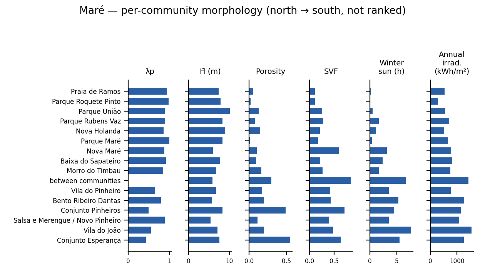

# Maré — morphology brief

*Draft for PI review. Prepared to support proposal teams planning research in Maré.*

## Purpose

MorphoFavela has already computed a detailed morphometric characterisation of
Maré — built form, sky access, solar exposure, and geometry-derived
ventilation tendencies — at ${mare_grid_resolution_m} m grid and
street-segment resolution across ${mare_study_area_km2} km² of Maré's
residential fabric. This brief summarises what exists so a proposal team can
scope new work against it rather than starting from zero: what is measured,
at what resolution, and what the PI can share. It is not a results paper —
it is an inventory, written for researchers deciding whether and how to
build on this morphological base.

*Study area: the IPP Territórios Sociais outline of Complexo da Maré
(Prefeitura do Rio de Janeiro / IPP) — a single contiguous
polygon covering the ${mare_study_area_n_communities_total} communities
recognised by Redes da Maré (boundary polygons: Prefeitura do Rio de
Janeiro SABREN favela limits (2022) and conjuntos habitacionais,
${mare_study_area_n_inferred_matches} of ${mare_study_area_n_communities_total}
name matches inferred rather than exact) plus the ground between them —
streets, canals, open land inside the complex, not attributed to any one
community. ${mare_study_area_excluded_name} lies outside the outline and
is excluded from every figure and count below; the remaining
${mare_study_area_n_communities_included} communities, plus the ground
between them, make up the ${mare_study_area_km2} km² reported throughout.*

## Maré at a glance

| | |
|---|---:|
| Area | ${mare_study_area_km2} km² |
| Typology | ${mare_typology} |
| Buildings (site + context) | ${mare_buildings_extended} |
| ${mare_grid_resolution_m} m grid cells | ${mare_cells_10m} (${mare_built_cells_share_pct}% built) |
| Mean building height (grid mean, built cells) | ${mare_mean_H_m} m |
| Annual mean street-level sun | ${mare_sun_annual_mean_h} h/day |
| Dominant wind sector | ${mare_wind_dominant_sector} (${mare_wind_dominant_freq_pct}% of observations) |

Maré is the largest of MorphoFavela's five campaign sites and the flattest —
a flatland settlement built out over former mangrove and reclaimed land,
organised around several distinct planned-housing projects and later
infill. Its scale and its structural regularity (large, near-saturated
block interiors) make it a useful counterpoint to the hillside sites in the
same campaign.

## Data inventory

| Layer | Resolution / unit | Provenance | Derived or restricted | Shareable form |
|---|---|---|---|---|
| Building footprints (input) | per-building polygon | municipal cadastre (2019) + LiDAR height attributes | restricted input | not shareable; pipeline is open |
| Digital terrain model (input) | ${mare_dtm_resolution_m} m raster | municipal DTM | restricted input | not shareable; pipeline is open |
| Morphometric grid | ${mare_grid_resolution_m} m cell, ${mare_cells_10m} cells | derived (λp, height, porosity, SVF per cell; terrain columns held back) | derived aggregate | shareable, de-georeferenced, without terrain columns |
| Street-level SVF and solar hours | per street sample point (${mare_street_points_n} points) | derived (ray-cast SVF + sun-position accumulation) | derived aggregate | shareable, de-georeferenced |
| Street-segment SVF | per segment (${mare_svf_street_n_segments} segments) | derived, aggregated from street points | derived aggregate | shareable, de-georeferenced |
| Geometry-derived ventilation tendencies | per built cell | derived (λf regime, lateral depth, wind exposure) | derived aggregate | shareable, de-georeferenced |
| Wind climatology | eight-sector rose | ${mare_wind_station}, ${mare_wind_n_obs} observations, ${mare_wind_year_start}–${mare_wind_year_end} | derived aggregate | shareable |

Per-cell georeferenced layers (coordinates attached) are available on request
under the project's data-sharing conditions; see Availability and terms,
below.

## Built form

Four indicators characterise the built fabric at ${mare_grid_resolution_m} m
resolution: plan density (λp — the fraction of each cell covered by
building footprint), mean building height, porosity (the complement of λp),
and Sky View Factor (SVF, the fraction of hemispheric sky visible at
pedestrian height).

Across all ${mare_cells_10m} grid cells (built and unbuilt), median λp is
${mare_lambda_p_median} (IQR ${mare_lambda_p_iqr_lo}–${mare_lambda_p_iqr_hi})
and median SVF is ${mare_svf_grid_median} (IQR
${mare_svf_grid_iqr_lo}–${mare_svf_grid_iqr_hi}). Restricted to the
${mare_built_cells_n} built cells (${mare_built_cells_share_pct}% of the
grid), median mean height is ${mare_H_mean_median} m (IQR
${mare_H_mean_iqr_lo}–${mare_H_mean_iqr_hi} m) and median height variability
(σH) is ${mare_sigma_h_median} m (IQR
${mare_sigma_h_iqr_lo}–${mare_sigma_h_iqr_hi} m) — consistent with the
predominantly two- to three-storey construction typical of the campaign.
Median porosity on built cells is ${mare_porosity_median} (IQR
${mare_porosity_iqr_lo}–${mare_porosity_iqr_hi}).

The high all-cell λp median reflects the study area itself, not the whole
bairro: restricted to the IPP Territórios Sociais outline (Redes da Maré's
${mare_study_area_n_communities_included} communities plus the ground
between them), most grid cells fall on or immediately next to a building,
whereas the bairro's open land and low-density fringes outside the
outline are excluded from the figure entirely rather than folded in and
pulling it down. The low built-cell porosity is consistent with this:
large, near-saturated housing-project block interiors dominate the study
area's built fabric.

## Sky access and sun

Street-level Sky View Factor and direct-sun hours are computed at
${mare_street_points_n} passageway sample points (aggregated to
${mare_svf_street_n_segments} street segments) via ray-casting and
sun-position accumulation on four reference dates. Median street-segment SVF
is ${mare_svf_street_median}.

Mean street-level direct-sun hours are ${mare_sun_winter_mean_h} h/day at
the winter reference date, ${mare_sun_annual_mean_h} h/day on the
unweighted annual proxy (mean of the four reference dates), and
${mare_sun_summer_mean_h} h/day in summer — a seasonal range of
${mare_sun_seasonal_range_h} h. Against the ${mare_diag_sun_floor_h} h/day
daylight-adequacy floor of the **Athens Charter (1943), Point 26**,
${mare_share_below_2h_winter_pct}% of street points fall below the floor at
the winter reference date, ${mare_share_below_2h_annual_pct}% on the annual
proxy, and ${mare_share_below_2h_summer_pct}% in summer.

## Geometry-derived ventilation potential

Three geometric tendencies — never air-exchange adequacies — extend the
built-form picture with two more degrees of ventilation-relevant structure:
vertical enclosure (λf regime), lateral depth into contiguous fabric, and
directional wind exposure. Across Maré's ${mare_geom_n_cells} built cells,
${mare_constraint_vertical_share_pct}% meet the campaign's high-enclosure
threshold on frontal-area density λf (vertical constraint),
${mare_constraint_lateral_share_pct}% sit at or
beyond the campaign's median lateral open-edge distance (lateral
constraint), and ${mare_constraint_directional_share_pct}% have a
directional wind-exposure ratio at or above the isotropic baseline
(directional constraint). Counting how many of these three independent
axes each cell trips: ${mare_n_constraints_0_share_pct}% trip none,
${mare_n_constraints_1_share_pct}% trip one, ${mare_n_constraints_2_share_pct}%
trip two, and ${mare_n_constraints_3_share_pct}% trip all three.

The wind climatology behind the directional axis comes from
${mare_wind_station} (${mare_wind_n_obs} observations,
${mare_wind_year_start}–${mare_wind_year_end}, calm fraction
${mare_wind_calm_share_pct}%). The dominant sector is
${mare_wind_dominant_sector} at ${mare_wind_dominant_freq_pct}% of
observations; the median directional wind-exposure ratio across Maré's
built cells sits near the isotropic baseline, at
${mare_exposure_ratio_median}.

A morphometric roughness-length estimate is also available per patch, but
its published method envelope is wide at Maré's density: across
${mare_roughness_n_patches} sampled patches, ${mare_roughness_out_of_envelope_share_pct}%
fall outside the calibration range of the published drag-partition methods
used, and ${mare_roughness_floored_share_pct}% hit the estimator's lower
floor. No absolute roughness value is reported here for that reason.

These geometric tendencies are a pre-simulation prioritisation surface, not
a ventilation verdict. A wind-simulation study of two Maré patches is a
parked companion track with no results to report at this time.

## Maré's communities

Redes da Maré recognises ${mare_subunit_n_communities} communities within
the study area; MorphoFavela's grid and the study-area sun/sky run
(${mare_subunit_wp04_run}) can both be labelled by which community each
cell or sample point falls in
(src.sites.territory.label_subunits), including the streets, canals, and
open ground between communities that the study area counts but no single
community claims ("between communities"). The panel and table below break
the site-wide figures above down to that resolution — density, height,
footprint, sky view, winter sun, and annual irradiation, one row per
community, ordered north to south by each community's mean grid-cell
position. This is a geographic ordering, not a ranking: no row is
privileged over another, and the two housing-project communities and the
older, denser communities are described side by side rather than
contrasted as better or worse.

${mare_subunit_table}

### A Maré-internal fabric grouping

"Maré among the five campaign sites", below, describes the campaign's
fabric-vector clustering, fit once across all five sites and applied here —
one cluster accounts for ${mare_campaign_dominant_share_pct}% of Maré's
built cells, because that fit has to separate Maré's fabric from four other
settlements' fabric at the same time, not because Maré's own fabric is
undifferentiated. Refitting the same clustering method restricted to
Maré's own ${mare_fabric_within_n_cells} built cells only — never pooled
with the other four sites, and with k chosen freshly rather than
inherited — gives a different picture:

${mare_fabric_within_composition}

The largest Maré-internal group holds ${mare_fabric_within_dominant_share_pct}%
of built cells, well below the campaign fit's ${mare_campaign_dominant_share_pct}%,
which is expected: a fit run only on Maré is free to resolve distinctions
within Maré's fabric that a five-site fit spends its clusters separating
sites instead. Both fits are legitimate for what they each answer — the
campaign fit for "where does Maré's fabric sit among the five sites",
this one for "how much internal variation does Maré's own fabric have" —
and neither supersedes the other.

## Maré among the five campaign sites

MorphoFavela's five-site campaign spans hillside and flatland informal
settlements in Rio de Janeiro. Maré is one of two flatland sites in the
campaign, distinguished among them by its scale and by the near-uniform
block interiors of its planned-housing sections. This section positions
Maré within that typology; it is not a ranking of the five sites. Unlike
the rest of this brief, the composition below covers Maré's whole analysed
data extent (the bairro), not the study area (the IPP Territórios Sociais
outline) — the underlying fabric-cluster fit is shared across all five
campaign sites and is not re-run per community.

${morphotype_composition}

## Availability and terms

Derived aggregates — the morphometric grid, street-level SVF and sun-hour
summaries, geometry-derived ventilation tendencies, and the wind
climatology — can be shared, including a de-georeferenced version of the
grid (relative cell indices, no coordinates). The underlying building
cadastre and LiDAR-derived terrain inputs cannot be shared in any form that
reconstructs them (licence-restricted third-party data). Per-cell
georeferenced layers are available on request under the project's
conditions.

Contact: ${pi_contact}

## Methods notes and references

- Sky View Factor: Tregenza sky discretisation, ray-cast at pedestrian
  height from passageway sample points.
- Frontal-area density and enclosure-threshold classification: Oke (1988);
  Stewart & Oke (2012), local climate zones.
- Daylight-adequacy floor: Athens Charter (1943), Point 26.
- Roughness-length estimation: morphometric drag-partition methods, method
  envelope only; not independently validated at time of writing.
