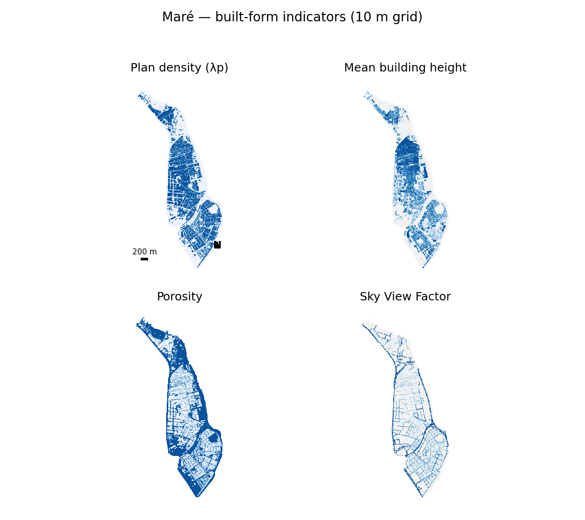
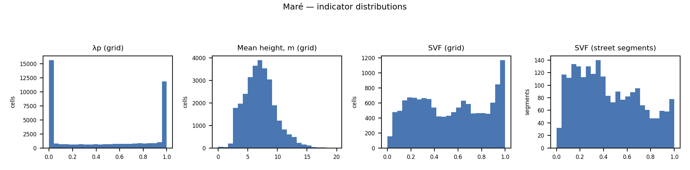
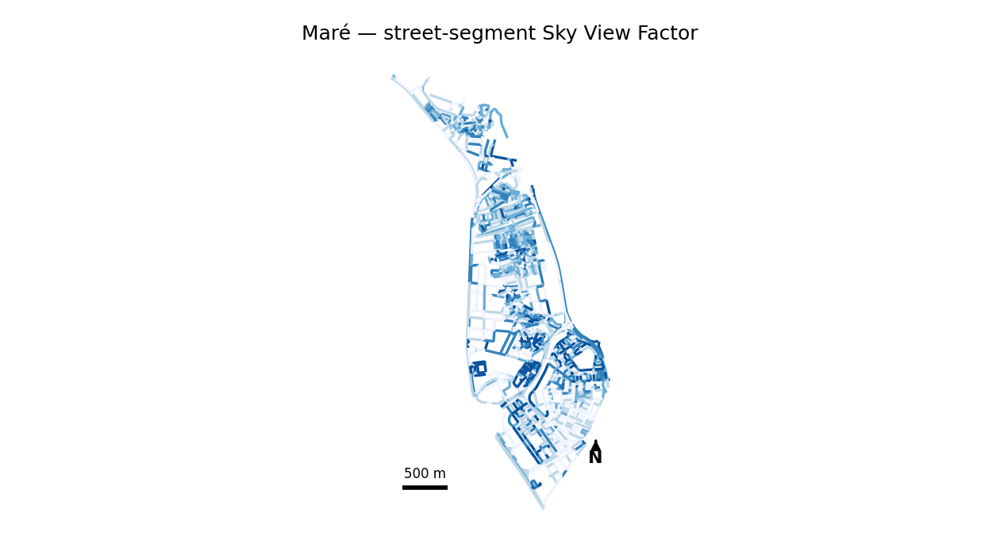
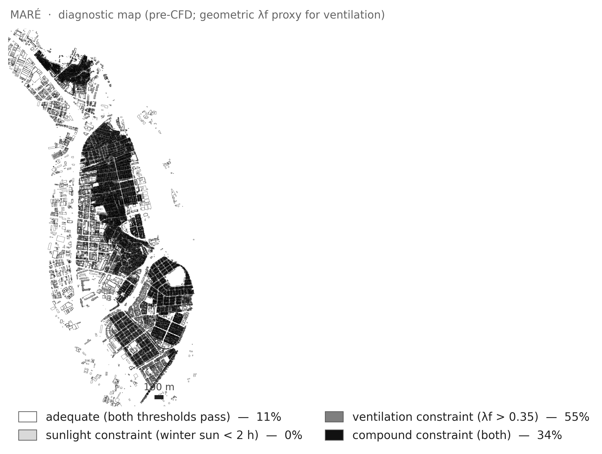
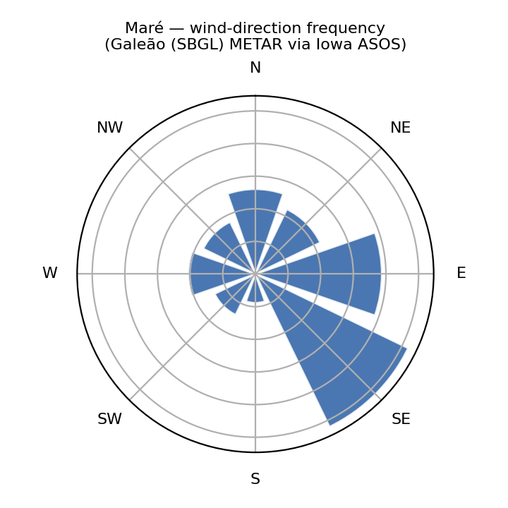

# Maré — morphology brief

*Draft for PI review. Prepared to support proposal teams planning research in Maré.*

## Purpose

MorphoFavela has already computed a detailed morphometric characterisation of
Maré — built form, sky access, solar exposure, and geometry-derived
ventilation tendencies — at ${mare_grid_resolution_m} m grid and
street-segment resolution across the whole ${mare_area_km2} km² settlement.
This brief summarises what exists so a proposal team can scope new work
against it rather than starting from zero: what is measured, at what
resolution, and what the PI can share. It is not a results paper — it is an
inventory, written for researchers deciding whether and how to build on this
morphological base.

## Maré at a glance

| | |
|---|---:|
| Area | ${mare_area_km2} km² |
| Typology | ${mare_typology} |
| Buildings (site + context) | ${mare_buildings_extended} |
| ${mare_grid_resolution_m} m grid cells | ${mare_cells_10m} (${mare_built_cells_share_pct}% built) |
| Mean building height | ${mare_mean_H_m} m |
| Annual mean street-level sun | ${mare_annual_mean_sun_h} h/day |
| Dominant wind sector | ${mare_wind_dominant_sector} (${mare_wind_dominant_freq_pct}% of observations) |

Maré is the largest of MorphoFavela's five campaign sites and the flattest —
a flatland settlement built out over former mangrove and reclaimed land,
organised around several distinct planned-housing projects and later
infill. Its scale and its structural regularity (large, near-saturated
block interiors) make it a useful counterpoint to the hillside sites in the
same campaign.

## Data inventory

| Layer | Resolution / unit | Provenance | Derived or restricted | Shareable form |
|---|---|---|---|---|
| Building footprints (input) | per-building polygon | municipal cadastre (2019) + LiDAR height attributes | restricted input | not shareable; pipeline is open |
| Digital terrain model (input) | ${mare_dtm_resolution_m} m raster | municipal DTM | restricted input | not shareable; pipeline is open |
| Morphometric grid | ${mare_grid_resolution_m} m cell, ${mare_cells_10m} cells | derived (λp, height, porosity, SVF, slope per cell) | derived aggregate | shareable, de-georeferenced |
| Street-level SVF and solar hours | per street sample point (${mare_street_points_n} points) | derived (ray-cast SVF + sun-position accumulation) | derived aggregate | shareable, de-georeferenced |
| Street-segment SVF | per segment (${mare_svf_street_n_segments} segments) | derived, aggregated from street points | derived aggregate | shareable, de-georeferenced |
| Geometry-derived ventilation tendencies | per built cell | derived (λf regime, lateral depth, wind exposure) | derived aggregate | shareable, de-georeferenced |
| Wind climatology | eight-sector rose | ${mare_wind_station}, ${mare_wind_n_obs} observations, ${mare_wind_year_start}–${mare_wind_year_end} | derived aggregate | shareable |

Per-cell georeferenced layers (coordinates attached) are available on request
under the project's data-sharing conditions; see Availability and terms,
below.

## Built form

Four indicators characterise the built fabric at ${mare_grid_resolution_m} m
resolution: plan density (λp — the fraction of each cell covered by
building footprint), mean building height, porosity (the complement of λp),
and Sky View Factor (SVF, the fraction of hemispheric sky visible at
pedestrian height).

**Figure One.** Plan density, mean height, porosity, and Sky View Factor
across Maré's grid, each in five discrete classes. No basemap; scale bar
and north arrow only.

Across all ${mare_cells_10m} grid cells (built and unbuilt), median λp is
${mare_lambda_p_median} (IQR ${mare_lambda_p_iqr_lo}–${mare_lambda_p_iqr_hi})
and median SVF is ${mare_svf_grid_median} (IQR
${mare_svf_grid_iqr_lo}–${mare_svf_grid_iqr_hi}). Restricted to the
${mare_built_cells_n} built cells (${mare_built_cells_share_pct}% of the
grid), median mean height is ${mare_H_mean_median} m (IQR
${mare_H_mean_iqr_lo}–${mare_H_mean_iqr_hi} m) and median height variability
(σH) is ${mare_sigma_h_median} m (IQR
${mare_sigma_h_iqr_lo}–${mare_sigma_h_iqr_hi} m) — consistent with the
predominantly two- to three-storey construction typical of the campaign.
Median porosity on built cells is ${mare_porosity_median} (IQR
${mare_porosity_iqr_lo}–${mare_porosity_iqr_hi}).

The low all-cell λp median alongside the low built-cell porosity reflects
Maré's structure: large, near-saturated housing-project block interiors
(porosity close to zero) separated by substantial unbuilt ground — open
land, canals, and the settlement's low-density fringes — that pulls the
whole-grid density figure down.

**Figure Two.** Histograms of λp, mean height, SVF (grid) and street-level
SVF (segments) across Maré.

## Sky access and sun

Street-level Sky View Factor and direct-sun hours are computed at
${mare_street_points_n} passageway sample points (aggregated to
${mare_svf_street_n_segments} street segments) via ray-casting and
sun-position accumulation on four reference dates. Median street-segment SVF
is ${mare_svf_street_median}.

**Figure Three.** Sky View Factor by street segment, five discrete classes;
no basemap, no coordinates.

Mean street-level direct-sun hours are ${mare_sun_winter_mean_h} h/day at
the winter reference date, ${mare_sun_annual_mean_h} h/day on the
unweighted annual proxy (mean of the four reference dates), and
${mare_sun_summer_mean_h} h/day in summer — a seasonal range of
${mare_sun_seasonal_range_h} h. Against the ${mare_diag_sun_floor_h} h/day
daylight-adequacy floor of the **Athens Charter (1943), Point 26**,
${mare_share_below_2h_winter_pct}% of street points fall below the floor at
the winter reference date, ${mare_share_below_2h_annual_pct}% on the annual
proxy, and ${mare_share_below_2h_summer_pct}% in summer.

A companion classification crosses this sun floor with the enclosure
threshold used elsewhere in the campaign (frontal-area density λf >
${mare_diag_enclosure_threshold}) at grid-cell resolution. Of the
${mare_diag_n_classified} classified cells, ${mare_diag_share_unconstrained_pct}%
meet the sun floor and sit below the enclosure threshold,
${mare_diag_share_sun_only_pct}% fall below the sun floor only,
${mare_diag_share_enclosure_only_pct}% sit above the enclosure threshold
only, and ${mare_diag_share_both_pct}% meet neither condition; the remaining
cells (${mare_diag_share_nodata_pct}% of the full grid) lack sufficient
sample coverage to classify.

**Figure Four.** Cell-level co-occurrence of the Athens Charter sun floor
and the campaign enclosure threshold, already band-classed for publication.

## Geometry-derived ventilation potential

Three geometric tendencies — never air-exchange adequacies — extend the
built-form picture with two more degrees of ventilation-relevant structure:
vertical enclosure (λf regime), lateral depth into contiguous fabric, and
directional wind exposure. Across Maré's ${mare_geom_n_cells} built cells,
${mare_constraint_vertical_share_pct}% meet the campaign's high-enclosure
threshold on frontal-area density λf (vertical constraint),
${mare_constraint_lateral_share_pct}% sit at or
beyond the campaign's median lateral open-edge distance (lateral
constraint), and ${mare_constraint_directional_share_pct}% have a
directional wind-exposure ratio at or above the isotropic baseline
(directional constraint). Counting how many of these three independent
axes each cell trips: ${mare_n_constraints_0_share_pct}% trip none,
${mare_n_constraints_1_share_pct}% trip one, ${mare_n_constraints_2_share_pct}%
trip two, and ${mare_n_constraints_3_share_pct}% trip all three.

The wind climatology behind the directional axis comes from
${mare_wind_station} (${mare_wind_n_obs} observations,
${mare_wind_year_start}–${mare_wind_year_end}, calm fraction
${mare_wind_calm_share_pct}%). The dominant sector is
${mare_wind_dominant_sector} at ${mare_wind_dominant_freq_pct}% of
observations; the median directional wind-exposure ratio across Maré's
built cells sits near the isotropic baseline, at
${mare_exposure_ratio_median}.

**Figure Five.** Measured wind-direction frequency, ${mare_wind_station}.

A morphometric roughness-length estimate is also available per patch, but
its published method envelope is wide at Maré's density: across
${mare_roughness_n_patches} sampled patches, ${mare_roughness_out_of_envelope_share_pct}%
fall outside the calibration range of the published drag-partition methods
used, and ${mare_roughness_floored_share_pct}% hit the estimator's lower
floor. No absolute roughness value is reported here for that reason.

These geometric tendencies are a pre-simulation prioritisation surface, not
a ventilation verdict. A wind-simulation study of two Maré patches is a
parked companion track with no results to report at this time.

## Maré among the five campaign sites

MorphoFavela's five-site campaign spans hillside and flatland informal
settlements in Rio de Janeiro. Maré is one of two flatland sites in the
campaign, distinguished among them by its scale and by the near-uniform
block interiors of its planned-housing sections. This section positions
Maré within that typology; it is not a ranking of the five sites.

The campaign's fabric-vector clustering assigns each built cell to one of
six recurring morphotypes. Maré's composition:

| Morphotype | Share of built cells |
|---|---:|
| T0 — Open Fringe | ${mare_morphotype_T0_pct}% |
| T1 — Flatland Consolidated | ${mare_morphotype_T1_pct}% |
| T2 — Hillside Fringe | ${mare_morphotype_T2_pct}% |
| T3 — Shaded Consolidated | ${mare_morphotype_T3_pct}% |
| T4 — Hillside Core | ${mare_morphotype_T4_pct}% |
| T5 — Saturated Core | ${mare_morphotype_T5_pct}% |

Maré's fabric is dominated by T5 Saturated Core (λp near its maximum), the
flatland-conditional type associated with the tight, near-fully-covered
block interiors of the original housing-project layout; T4 Hillside Core,
the type universal across all five campaign sites, is present as a
secondary component. T1 and T5 are present only where flat buildable land
exists, which is why they concentrate at the two flatland sites rather than
recurring campaign-wide.

## Availability and terms

Derived aggregates — the morphometric grid, street-level SVF and sun-hour
summaries, geometry-derived ventilation tendencies, and the wind
climatology — can be shared, including a de-georeferenced version of the
grid (relative cell indices, no coordinates). The underlying building
cadastre and LiDAR-derived terrain inputs cannot be shared in any form that
reconstructs them (licence-restricted third-party data). Per-cell
georeferenced layers are available on request under the project's
conditions.

Contact: ${pi_contact}

## Methods notes and references

- Sky View Factor: Tregenza sky discretisation, ray-cast at pedestrian
  height from passageway sample points.
- Frontal-area density and enclosure-threshold classification: Oke (1988);
  Stewart & Oke (2012), local climate zones.
- Daylight-adequacy floor: Athens Charter (1943), Point 26.
- Roughness-length estimation: morphometric drag-partition methods, method
  envelope only; not independently validated at time of writing.
