# Brisa+ Technical Report

## Urban Morphology and CFD Patch Sampling for Wind Simulation Across Five Informal Settlements in Rio de Janeiro

| | |
|---|---|
| **Document version** | TR v1.2 (pre-CFD; +morphology signature §5.5, ventilation tendencies §5.6, roughness §6.6) |
| **Pipeline version** | v6.0 (June 2026 milestone — ROADMAP.md) |
| **Build date** | 2026-06-27 |
| **Last numerical sweep** | [`904040e`](https://github.com/thrmnn/MorphoFavela/commit/904040e) (2026-05-03) |
| **Author** | Theo Hermann · MIT · `thermann.ai@gmail.com` |
| **Repository** | https://github.com/thrmnn/MorphoFavela |
| **License** | MIT (code) · CC-BY-4.0 (this report) |
| **Audience** | Engineering reviewers; researchers reproducing or extending the pipeline; CFD team consuming the patch contract. *Not* a journal manuscript — that lives separately and cites this report. |

For terminology, see **§0 Glossary** below; for reproducibility, see
**§12 Reproducibility**; for failure modes and observability, see
**§13 Failure modes**.

---

## Executive Summary

This report documents the morphometric analysis and CFD sampling pipeline
developed for five informal settlements in Rio de Janeiro: Vidigal, Rocinha,
Rio das Pedras, Complexo do Alemão, and Maré. The work supports the Brisa+
project, which aims to quantify pedestrian-level wind conditions in informal
urban fabric and link them to health-relevant outcomes (thermal comfort,
pollutant dispersion, natural ventilation).

**For an engineering reviewer, in three sentences.** *What to use:*
the 119-patch CFD sampling campaign (per-patch `buildings.gpkg` +
`terrain.tif` + `patch_meta.json`) and the morphometric grid (10 m,
20+ indicators per cell) are stable and ready to consume — every output
path is documented in §8 and reproducible from §12. *What not to trust
yet:* anything labelled "annualised" or "wind-velocity coupled" in §11,
because no real OpenFOAM results have returned from the cluster — the
result-side pipeline is shipped and synthetic-validated end-to-end on
all 5 sites, but the producer interface has not been exercised against
real data. *What's pending:* VDG-P07 ingestion (in flight at MIT ORCD),
followed by incremental submission of the remaining 118 patches and
annualisation against the measured wind roses.

At time of writing, the pipeline has produced:

- **98,415 building footprints** compiled from site-specific and city-wide
  cadastral data, with defensive geometry repair and extended context beyond
  each favela boundary.
- **82,314 grid cells at 10 m resolution** covering the five sites, each
  characterised by 20+ morphometric indicators including Sky View Factor,
  plan area density, 8-direction frontal area density, volumetric porosity,
  height variability, slope, aspect, and street orientation entropy.
- **119 CFD simulation patches** selected via stratified sampling across
  twelve morphometric strata (SVF × slope × λp) with maximin geographic
  spacing and SVF-priority weighting to oversample health-relevant low-sky-
  view conditions.
- **A complete CFD integration pipeline** (`src/cfd_integration/`,
  71 passing tests) ready to ingest OpenFOAM results when the simulation
  campaign completes in the parallel CFD repository. The result-side
  analysis pipeline (`scripts/analyze_cfd_results.py`) is shipped and
  synthetic-validated end-to-end on all 5 sites; awaiting the first real
  return (VDG-P07).
- **A favela morphological signature** (§5.5): a 6-class cell *morphotype* and a
  3-class block *morphotope* learned from geometry alone; four of six morphotypes
  recur across favelas, and a held-out experienced-deprivation gradient (winter-sun
  failure 0 → 1.0 across the density spine) validates them out-of-sample. *Caveat:*
  k = 6 is a domain-driven granularity (internal indices favour coarser), justified
  by cross-site reproducibility, not a distance-based optimum.
- **Aerodynamic roughness, with a hard caveat** (§6.6): morphometric z0/zd per cell —
  but **physically invalid in 53–75 % of cells** at favela density (out of every
  method's envelope). The reportable result is the ~20× method-spread *envelope*;
  absolute z0 is CFD-gated. Do not consume the per-cell z0 as a measurement.

The pipeline is fully reproducible from the committed scripts; all inputs
are documented and all intermediate outputs preserved in the canonical
repository layout. This document summarises the methodology, validates
the sampling design, and specifies the interface between this repository
and the CFD execution environment.

---

## 0. Glossary / Nomenclature

Domain-specific terms used throughout this report. Each is defined once
here, with units. Sections cite the term name; the definition lives only
in this section.

### Morphometric indicators (per 10 m grid cell)

| Term | Symbol | Units | Definition |
|---|---|---|---|
| Sky View Factor | SVF | — (0–1) | Fraction of the upper hemisphere visible from a sample point at 1.5 m above ground. Cell value = mean over passageway samples whose centroid falls in the cell. Method: §4.2. |
| Plan area density (Building Coverage Ratio) | λp, BCR | — (0–1) | Sum of building footprint area in the cell ÷ cell area. Capped at 1.0 to prevent over-counting from overlapping footprints. |
| Frontal area density | λf | — | Projected vertical surface area per unit horizontal cell area, computed for 8 wind directions; stored as `lambda_f_{N,NE,…,NW}`, plus `lambda_f_mean` (mean across directions) and `lambda_f_max` (worst-case direction). Facade segments clipped to the cell since 2026-06 (§4.2). Primary input to wind-canopy drag models. |
| Volumetric porosity | — | — (0–1) | `1 − (Σ building_volume_in_cell) / (cell_area × H_mean)`. Strongly anti-correlated with λp (r ≈ −0.95). |
| Height variability | σH | m | Standard deviation of building heights in the cell. NaN if < 2 buildings. |
| Mean building height | H_mean | m | Arithmetic mean of contributing building heights. Cell-level average — see §1 footnote on aggregation. |
| Max analysis-patch height | H_max_analysis | m | Tallest building inside a 100 m-diameter analysis patch (used for Blocken fetch check). |
| Slope, aspect | — | °, ° | Cell-mean terrain slope and aspect from the merged DTM via numpy gradient. Aspect uses circular mean. Both are active predictors in the §5.3 aspect analysis (slope as scalar, aspect via sin/cos pair) and the §7.4 CFD regression (aspect adds an aspect↔wind alignment covariate). |
| Street orientation entropy | — | — (0–1) | Normalised Shannon entropy of street-segment bearings (folded to [0, 180°)) within the cell. 0 = single direction, 1 = uniform. |

### Sky-view conventions

| Term | Definition |
|---|---|
| **Tregenza-145** | Equal-area discretisation of the sky hemisphere into 145 patches (Tregenza, 1987). The MorphoFavela SVF engine ray-casts into the centroid of each patch from each sample point and reports the unobstructed fraction. |
| **`svfForProcessing153`** | UMEP's shadow-cast SVF processor with 153-patch sky discretisation (Lindberg & Holmer, 2010, used in SOLWEIG). Used as the independent benchmark in §4.2 / §10.3 cross-validation. |
| **Height-matched** | Both engines integrate at z = 1.5 m above ground, achieved in MorphoFavela via passageway sampling and in UMEP by lowering all building heights by 1.5 m before the shadow-cast. |
| **Passageway aggregation** | SVF cell value comes from samples on traversable ground (streets, alleys, courtyards) — never centroids inside building footprints, which would bias to 0. |

### CFD sampling

| Term | Definition |
|---|---|
| **Analysis patch** | 100 m-diameter circle (radius 50 m, area ≈ 7,854 m²) where pedestrian-level metrics are sampled. |
| **CFD domain** | Per-direction rectangular `blockMesh` sized to `5/15/5/5 · H_max + R_patch` upstream/downstream/lateral/top, with a `5 · W_patch = 500 m` lateral floor (Blocken 2015 wide-obstacle). One mesh per patch × wind-direction = 952 meshes for 119 patches × 8 directions. Canonical rule set: `src/cfd_integration/rectangular_domain_v1.json`. |
| **12 strata** | Cross-product of SVF (3 bins: < 0.15, 0.15–0.30, ≥ 0.30) × slope (2 bins: < 15°, ≥ 15°) × λp (2 bins: < 0.5, ≥ 0.5). Stratum IDs encoded `SVFn_SLPn_LPn`. |
| **Maximin spacing** | Greedy maximin geographic distance between patch centres, with an 80 m floor. Produces a spatially diverse sample within each stratum. |
| **Silhouette blockage** | CFD blockage gating quantity. `B = D · H_max / (2 · lateral · top)` — treats the 100 m analysis disk as a single solid block of height H_max (AIJ benchmark convention for wide-cluster CFD). Gate: `B < 0.05` (Tominaga 2008). Uniform 2 % across the campaign once 5·W lateral floor dominates. |
| **λ_F (frontal area density)** | Per-direction `Σ(projected_facade × height) / disk_area`, computed for 8 wind directions. The literature canopy-parameterisation form (Tominaga 2008 §3) — sums all facades, no shadowing, routinely > 1.0 in dense favela patches. Reported per-row alongside the blockage gate but *not* the gating quantity (silhouette envelope is). |
| **Source-data envelope** | The half-diagonal of the rotated worst-case rectangular domain plus a 50 m additive safety margin. Bounds the per-patch radius needed in `buildings_extended_*.gpkg` and `dtm_extended_*.tif` to cover all 8 wind-direction meshes. Range across the campaign: 565–646 m; `buildings_extended_700m.gpkg` covers all 119 patches. |

### Wind / atmosphere

| Term | Definition |
|---|---|
| **Wind rose** | Per-site 8-direction frequency × mean-speed climatology, stored as `data/{site}/wind_rose.json`. Used post-hoc to weight the 8 directional CFD simulations into an annualised metric — *not* used for boundary conditions. |
| **Calm fraction** | Fraction of hourly observations with `\|U\| < 0.5 m/s` or direction = NaN. Excluded from direction binning but recorded explicitly. |
| **Neutral log-law** | Inflow profile assumed for all CFD runs: `u(z) = (u_*/κ) ln((z+z₀)/z₀)`. Implies neutral atmospheric stability; deliberate methodological simplification (§10.1). |
| **k-ω SST** | Shear-Stress-Transport k-ω turbulence closure (Menter, 1994). Standard for ABL-scale RANS. |
| **ACH** | Air change rate per hour: `ACH = 3600 × ⟨\|U\|⟩ / L`, with L the canyon characteristic length. |
| **TI** | Turbulence intensity: `TI = √(2/3 · TKE) / U_ref`. |
| **TKE** | Turbulent kinetic energy. |
| **Stagnation fraction** | Fraction of patch sample points with `\|U\| < 0.5 m/s`. |

### Data sources

| Term | Definition |
|---|---|
| **DTM** | Digital terrain model (bare-earth raster). |
| **DSM** | Digital surface model (DTM plus buildings/vegetation). |
| **INMET BDMEP** | *Banco de Dados Meteorológicos para Ensino e Pesquisa* — the Brazilian Met. Service's hourly archive. Source for 4 of 5 wind-rose stations (A652, A636, A621, A602). |
| **ASOS** | Automated Surface Observing System — Iowa State's archive of international airport METAR; source for SBGL Galeão (Maré). |
| **METAR** | Standardised aviation weather report format. |
| **EPSG:31983** | SIRGAS 2000 / UTM Zone 23S — the project's canonical projected CRS. |

---

## 1. Study Sites

Five favelas were selected to span the morphological typologies of Rio
informal settlements:

| Site | Area | Type | Buildings (extended) | 10 m cells | Mean H † | Annual mean sun ‡ |
|------|-----:|------|--------------------:|-----------:|--------:|----------------:|
| Vidigal | 0.30 km² | hillside | 4,599 | 3,169 | 6.3 m | 4.53 h |
| Rocinha | 0.80 km² | hillside | 14,435 | 8,972 | 8.1 m | 3.30 h |
| Rio das Pedras | 0.70 km² | flatland | 11,276 | 7,046 | 8.7 m | 3.14 h |
| Complexo do Alemão | 1.97 km² | mixed | 28,783 | 19,708 | 5.3 m | 5.03 h |
| Maré | 4.34 km² | flatland | 39,322 | 43,419 | 7.1 m | 7.07 h |
| **TOTAL** | **8.11 km²** | | **98,415** | **82,314** | — | — |

*Extended buildings = site footprints plus context buildings within a 300 m
buffer (see Section 3.2; the v1 CFD campaign uses the additional 700 m
extension produced in May 2026). Typology assignment drives wind-regime
analysis: hillside sites span 0–45° slopes; flatland sites cluster near 0°.*

*† Mean building height = mean of `H_mean` across all eligible 10 m grid
cells per site (`outputs/{site}/morphometrics/grid/grid_metrics.gpkg`).
This is a cell-area-weighted aggregation, not a per-building mean — short
ancillary structures contribute less than the multi-storey blocks that
fill more of the eligible cell area.*

*‡ Annual mean street-level direct sun = mean of `solar_hours_annual` across
all street points in
`outputs/{site}/morphometrics/svf/svf_streets_solar.gpkg`. The annual
proxy is the unweighted mean of the four reference dates (winter/summer
solstice + March/September equinox); see §5.4.*

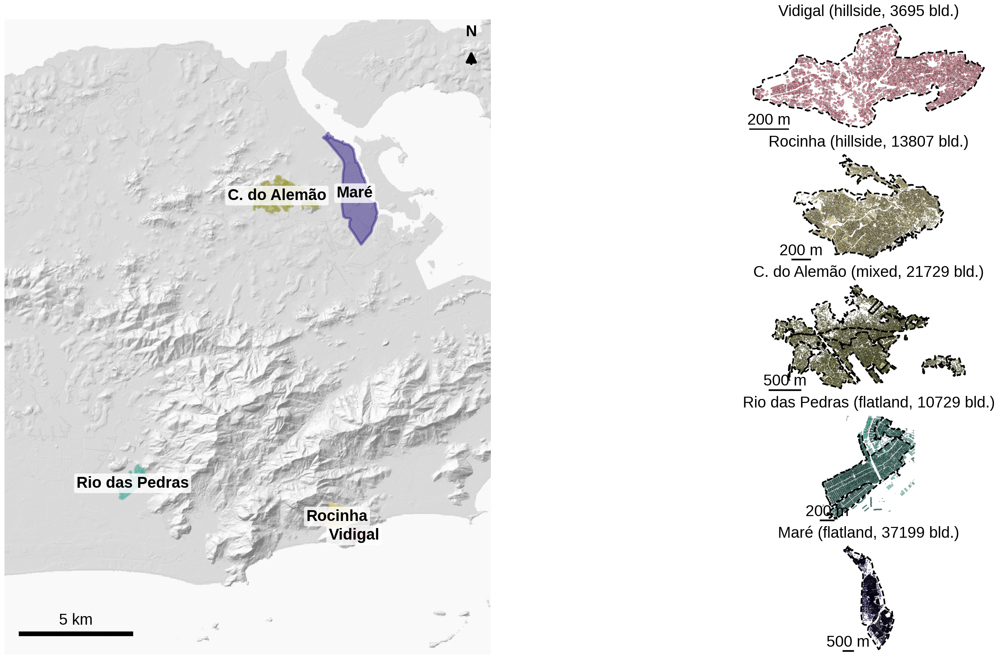

**Figure 1.** Overview of the five campaign sites on the Rio de Janeiro
hillshade. The main panel shows the full metropolitan extent with all 1,074
registered favelas outlined in light grey; the five campaign sites are
highlighted with typology-coloured fills. Right panels show each site's
building footprints at a consistent visual style, with favela boundary and
building count. Vidigal and Rocinha occupy the steep south-zone hillslopes
near Sugarloaf; Maré and Complexo do Alemão are in the flat north-zone
bayside plain; Rio das Pedras is in the west-zone plain.

Cidade de Deus was initially considered but excluded from the CFD campaign
due to a building-data defect: its SVF values saturated at
≈ 0.90, indicating missing building footprints in the computational scene.

---

## 2. Data Sources

### 2.1 Site-specific data

Each site has a `data/{site}/raw/` directory containing:

- **Building footprints** (.shp, 3D polygons) with attributes `altura`
  (height above base), `base` (base elevation), `topo` (top elevation).
  CRS: EPSG:31983 (SIRGAS 2000 / UTM zone 23S).
- **Favela boundary** (.shp) from the 2019 Rio municipal cadastre.
- **Digital terrain model** (.tif) at 5 m resolution clipped to the site
  extent during data preparation (manually in GIS; not regenerated
  code-side per project memory).
- **Road network** (.shp) from the municipal `Logradouros` dataset,
  clipped and projected per site.

### 2.2 City-wide data (shared across sites)

Used to extend the building context and ensure continuous terrain for CFD
domains that exceed individual favela boundaries.

- **`data/RJ/buildings_RJ_2019.shp`**: 2,362,806 building footprints for
  the entire municipality. Same schema as per-site files (subset extracted
  from this source).
- **`data/RJ/DTM_RJ.tif`**: 72 km × 37 km DTM at 5 m resolution covering
  all of Rio.
- **`data/RJ/Favelas_Limit_2019.shp`**: 1,074 registered favelas, used
  for the Figure 1 overview.

### 2.3 Wind forcing (INMET)

Annualised wind roses are required to weight CFD results across the eight
cardinal directions. Each site has a `data/{site}/wind_rose.json` file
whose schema is defined by `src.cfd_integration.schema.WindRose` — frequencies
and mean speeds per direction, plus provenance metadata (station id,
coordinates, time window, observation count, calm fraction, anemometer
reference height, and a `quality_flag` ∈ {`measured`, `gap-filled`,
`placeholder-prior`}).

**Current status (April 2026).** All five `wind_rose.json` files now
carry measured hourly observations across the full 2015–2024 window
and are tagged `quality_flag: "measured"`. The four hillside / inland
sites use INMET BDMEP records; Maré uses the Iowa State ASOS METAR
archive of SBGL Galeão. Sample sizes range from n = 64,088 (A636
Jacarepaguá, which only began reporting in August 2017) to n = 89,439
(SBGL). Per-site directional frequencies, mean speeds, and calm
fractions are shown in **Figure S5**
(`docs/technical_report/figures/figS5_wind_roses.png`):

| Site (station) | n | Window | Calm | Prevailing dir | Notes |
|---|---|---|---|---|---|
| Vidigal / Rocinha (A652 Forte de Copacabana) | 85,103 | 2015–2024 | 1.4 % | E (30 %), W (23 %) | Coastal cliff: bimodal sea-breeze and reverse-channel along the Dois Irmãos saddle. |
| Rio das Pedras (A636 Jacarepaguá) | 64,088 | 2017–2024 | 46.3 % | SW (26 %), W (20 %) | Sheltered basin, weak winds (Ū ≈ 1.3 m/s); high calm fraction reflects the Jacarepaguá lowland regime, not measurement gaps. |
| Complexo do Alemão (A621 Vila Militar) | 86,019 | 2015–2024 | 33.1 % | N (25 %), SW (19 %) | North-zone interior; bay sea-breeze + post-frontal SW pattern. |
| Maré (SBGL Galeão METAR) | 89,439 | 2015–2024 | 3.7 % | SE (26 %), E (19 %) | Bay regime; continuous METAR coverage gives the largest sample. |

**Recommended stations** (verified April 2026 against the INMET
catalogue, daily-graph URLs, and the published TMY paper for A652):

| Site | Station | Code | Coords (lat, lon) | Class | Notes |
|------|---------|------|-------------------|-------|-------|
| Vidigal | Forte de Copacabana | A652 | −22.988, −43.190 | coastal | Nearest unobstructed coastal reference (~5 km E). CFD captures the Dois Irmãos lee-side locally; inflow rose stays at A652. |
| Rocinha | Forte de Copacabana | A652 | −22.988, −43.190 | coastal | Provides the unobstructed SE→NE driver. Valley channelling is resolved by the CFD itself. |
| Rio das Pedras | Jacarepaguá | A636 | −22.99, −43.37 | plain | Colocated with the Jacarepaguá lowland. |
| Complexo do Alemão | Vila Militar | A621 | −22.86, −43.41 | urban interior | Closest north-zone station (~8 km W). Corrects the earlier placeholder recommendation of A602 Marambaia, which is geographically mismatched (southwest coast, not north zone). |
| Maré | SBGL Galeão METAR (preferred); A652 (INMET fallback) | — / A652 | −22.81, −43.25 / −22.988, −43.190 | bayside | Galeão airport METAR via the Iowa State ASOS archive is the best match for the bay regime; ingested via `build_wind_rose.from_iowa_asos_csv`. A652 is the INMET fallback. |

**The earlier placeholder attributed A652 to "Alto da Boa Vista" — that
name belongs to the municipal Alerta Rio network, not INMET. A652 is
Forte de Copacabana. The station table is corrected here.**

**Data acquisition.** INMET publishes one nationwide yearly ZIP
(~100 MB) at
`https://portal.inmet.gov.br/uploads/dadoshistoricos/{YEAR}.zip`, live
and unauthenticated (browser User-Agent required). Each ZIP contains
one CSV per automatic station for the year. The ingestion pipeline is
documented in `src/cfd_integration/README.md` and implemented in
`scripts/build_wind_rose.py from_inmet_csv`.

BDMEP CSV format: `sep=;`, `decimal=,`, latin-1 encoding, 8-row
metadata header, missing values encoded as −9999, anemometer at z =
10 m. Calm periods (|U| < 0.5 m/s or direction = NaN) are excluded
from direction binning but recorded in `calm_fraction` so they are not
hidden.

**Neutral-stability assumption.** The k-ω SST inlet uses a log-law
profile that implicitly assumes a neutral atmospheric boundary layer.
For Rio, daytime unstable convection and evening stable inversions
bias the stagnation metric. This limitation is accepted for the
screening campaign and documented in §10. A future campaign could
stratify the rose by stability class (e.g., day vs night, or
Pasquill-Gifford class).

### 2.4 Coordinate reference system

All vector and raster data are in **EPSG:31983 (SIRGAS 2000 / UTM zone 23S)**,
verified on load. Mixed-CRS inputs are reprojected automatically in the
pipeline.

---

## 3. Data Preparation

### 3.1 Building footprint processing

Raw footprints undergo three processing steps before use:

1. **Topology validation.** Shapely's `is_valid` flag is checked on all
   geometries. Rocinha was found to have 10 self-intersecting polygons
   (0.07 %) out of 13,807; all other sites had zero invalid geometries.
   All invalids are self-intersections (common artefact of municipal GIS
   digitisation) and are repaired by `buffer(0)`, which corrects the
   geometry with sub-square-metre area change. The repair is applied
   defensively in both the extended-context builder and the morphometric
   pipeline before any spatial operation. Full audit:
   `outputs/comparative/audits/rocinha_topology_audit.md`.

2. **Height validation.** `altura` values are checked for negatives
   (none) and unrealistic extremes (one building > 50 m — a legitimate
   high-rise in context data near a favela).

3. **CRS enforcement.** If source CRS differs from EPSG:31983, the
   dataset is reprojected.

### 3.2 Extended building context

**Problem.** Each CFD simulation needs building + terrain context out
to the rectangular per-direction domain envelope (§6.5,
`rectangular_domain_v1.json`). The rotated worst-case rectangle has
half-diagonal 565–646 m across our 119-patch campaign — the
campaign-maximum is RDP-P15 at 646 m (`H_max_analysis` = 27.3 m). A
naïve sampling restricted to patches fully within the favela excludes
55 % of candidate cells at Vidigal.

**Solution.** Two passes:

1. **Initial 300 m extension** (used by the original eligibility filter
   and SVF cross-validation). The city-wide RJ building dataset is
   clipped to a 300 m buffer around each favela boundary and merged
   with the site-specific dataset, preferring site data where
   footprints overlap (deduplication via spatial join). This is the
   buffer documented in Figure S2.
2. **700 m extension for v1 CFD domains** (May 2026 migration). The
   same merge, larger buffer — covers the rectangular source-data
   envelope of every campaign patch, including RDP-P15 at 646 m. All
   five sites have both `buildings_extended_300m.gpkg` and
   `buildings_extended_700m.gpkg` (and matching DTMs); the CFD-side
   `build_patch_case.py` uses the 700 m product.

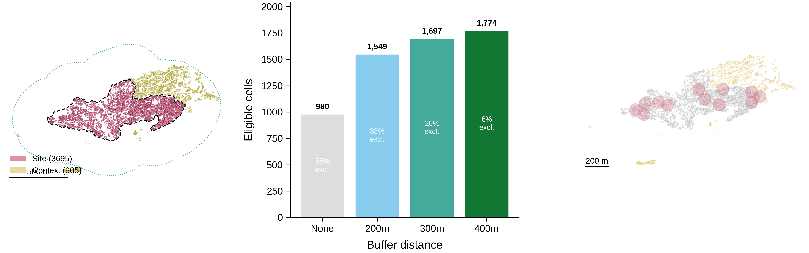

**Figure S2.** Context extension for Vidigal at the original 300 m
buffer. Left: site buildings (blue) within the boundary and context
buildings (orange) from city-wide data within the 300 m buffer. Middle:
candidate-pool sensitivity to buffer distance — 0 m yields 980 eligible
cells (31 %); 300 m yields 1,697 (54 %); 400 m only adds 77 more
(diminishing returns at the eligibility-filter level). Right: pilot
patch locations on the extended footprint — without the extension,
patches cluster on the interior; with it, they span the full favela
plus its immediate fringe. The 700 m v1 buffer extends the same
construction further; counts grow to 10,713 buildings at Vidigal,
46,390 at Maré.

Extended buildings per site:

| Site | Site buildings | Context buildings | Extended total |
|------|--------------:|-----------------:|---------------:|
| Vidigal | 3,695 | 904 | 4,599 |
| Rocinha | 13,802 | 633 | 14,435 |
| Rio das Pedras | 10,729 | 547 | 11,276 |
| Complexo do Alemão | 21,729 | 7,054 | 28,783 |
| Maré | 37,188 | 2,134 | 39,322 |

Implementation: `scripts/build_extended_context.py`. The 300 m buffer was
selected as the inflection point of a sensitivity scan (200 m / 300 m /
400 m); 300 m reduces domain-extent exclusion to ≤ 20 % at all sites
while adding modest file size.

### 3.3 Extended terrain

The site-specific DTM is merged with the city-wide RJ DTM (both 5 m
resolution) over the same 300 m buffer. The site DTM takes priority in
overlap regions (`rasterio.merge.merge` with `method="first"`). A
post-merge sanitisation step replaces any residual float32-max sentinel
values (historical nodata artefact) with a clean nodata = −9999 and
declares it in the output profile. This was found to be necessary after
the first run produced downstream warnings about values of order 3.4×10³⁸
in the merged raster.

---

## 4. Morphometric Grid

### 4.1 Grid construction

A regular 10 m grid is generated covering each extended-buildings extent,
then clipped to the favela boundary so that only cells whose centroid
falls within the settlement are retained. Cells range from 3,169 at
Vidigal to 43,419 at Maré, with total 82,314 cells across the five sites.

### 4.2 Indicators

Per 10 m cell, the pipeline computes:

**Sky View Factor (SVF).** The fraction of hemispheric sky visible from
pedestrian height. Computed at 1.5 m above the ground surface via
Tregenza 145-patch ray-casting on a sample grid of passageway points;
the per-cell value is the mean of all sample points whose centroid falls
within the cell. An `svf_count` column records the number of contributing
sample points per cell (mean per site ranges from 1.9 (Maré) to 12.9
(Vidigal); pooled mean 3.5; minimum 1). Cells with no contributing samples
receive NaN. The cross-site spread reflects passageway density: hillside
fabrics with narrow, frequent corridors yield more samples per cell than
flatland blocks where samples concentrate in a few wide streets.

Critically, SVF is **aggregated from passageway samples, not computed at
grid-cell centroids**. Centroid computation would bias SVF toward 0 for
cells whose centroid falls inside a building; passageway aggregation
avoids this artefact. A diagnostic verification confirmed no spurious
SVF = 0 spikes (see `src/morphometry/grid.py::_aggregate_svf_to_grid`
and `docs/technical_report/validation.md`).

**Cross-validation against UMEP.** The Tregenza-145 ray-cast SVF was
benchmarked against UMEP's shadow-casting SVF processor
(`svfForProcessing153`, Lindberg & Holmer 2010, used in SOLWEIG) on a
1 m digital surface model rasterised from the same building footprints
and DTM. UMEP averages over 153 hemispherical patches via shadow-casting
on the DSM rather than ray-casting on a 3D mesh; this is an
algorithmically distinct independent reference. To make the two engines
height-comparable, we lower every building height by 1.5 m before
running UMEP — equivalent to lifting the integration plane to
pedestrian height — and mask rooftop pixels (UMEP otherwise includes
them, MorphoFavela does not because passageway samples never fall on roofs).
Aggregating UMEP at the same 10 m grid across all five sites:

| Site | n | r² | slope | RMSE | bias (UMEP − MorphoFavela) |
|---|---:|---:|---:|---:|---:|
| Vidigal | 2,510 | 0.68 | 0.96 | 0.12 | +0.01 |
| Rocinha | 5,646 | 0.81 | 1.01 | 0.14 | +0.09 |
| Rio das Pedras | 1,503 | 0.93 | 1.25 | 0.11 | +0.08 |
| Complexo do Alemão | 4,838 | 0.76 | 0.92 | 0.17 | +0.14 |
| Maré | 9,516 | 0.94 | 0.97 | 0.12 | +0.09 |

Across all five sites the engines agree on the same physical quantity:
four of five regression slopes (Vidigal 0.96, Rocinha 1.01, Complexo do
Alemão 0.92, Maré 0.97) fall within ±8 % of unity. Rio das Pedras is
the slope outlier at 1.25 — the site has the smallest valid grid
(n = 1,503 after eligibility filtering), and its eligible cells are
concentrated in the 0.3–0.5 SVF range where the 153-patch shadow-casting
integration picks up partial obstruction that the 145-patch ray-cast
smooths through. This is a sensitivity to grid coverage at smaller
settlement extents, not a discrepancy in how the two engines compute
SVF.

The r² range (0.68–0.94) tracks site relief: low-relief, spatially
coherent fabrics (Maré 0.94, Rio das Pedras 0.93) yield the strongest
per-cell agreement because adjacent cells share local terrain and
similar average obstruction. High-relief hillside settlements
(Vidigal 0.68, Complexo do Alemão 0.76, Rocinha 0.81) produce more
cell-to-cell variation between integrators because each cell sits in a
distinct local viewshed.

All five biases are positive (UMEP integrates over more sky than MorphoFavela),
ranging from +0.01 (Vidigal) to +0.14 (Complexo do Alemão). The
direction is consistent with the +1.5 m raised-observer transform
applied to building heights before running UMEP: structures shorter
than 1.5 m get partially or fully zeroed in MorphoFavela's input, opening
additional sky in the UMEP comparison. Sites with substantial single-
storey residential coverage (Complexo do Alemão, Maré, Rocinha,
Rio das Pedras) sit in the +0.08 to +0.14 range; Vidigal's +0.01
reflects a footprint dominated by taller multi-storey blocks where the
height shift has limited effect. The Vidigal bias collapse from
−0.05 (z = 0, prior comparison) to +0.01 (z = 1.5) confirms the
systematic offset is the sampling-height difference rather than the
algorithmic distinction between ray-casting on a 3D mesh and
shadow-casting on a DSM. See `scripts/validate_svf_against_umep.py`
and `outputs/{site}/morphometrics/svf/umep_validation/`.

**Plan area density (λp, BCR).** Building footprint area ÷ cell area.
Capped at 1.0 to prevent over-counting from overlapping footprints in
dense informal fabric.

**Frontal area density (λf).** Projected vertical surface area per unit
horizontal cell area, computed for eight wind directions (N, NE, E, SE,
S, SW, W, NW); stored as `lambda_f_{direction}` plus `lambda_f_mean` and
`lambda_f_max`. Directional λf is the primary morphological input to
wind-canopy drag models. Facade segments are **clipped to the cell
boundary** before accumulation (repair of 2026-06-02, commit `e2252f4`):
earlier grids attributed the full length of facades crossing a cell
border to that cell, inflating per-cell λf 2–3×. All published grids
were regenerated in place; λf values in earlier revisions of this
report are superseded. As of the latest re-baseline, λf is computed on
**dissolved footprints** (party-wall-corrected — touching cadastral
footprints are unioned before projection): the earlier "summed" form
double-counted shared party walls as frontal area, over-counting λf
≈1.7×. The pooled built-cell median λf ≈ 0.83 (cell scale, dissolved).

**Volumetric porosity.** `1 − (Σ building_volume_in_cell) / (cell_area ×
H_mean)`. Characterises the void fraction in the urban canopy; strongly
anti-correlated with λp (r ≈ −0.95 across sites, see Section 5.3).

**Height variability (σH).** Standard deviation of building heights in
the cell. Cells with < 2 buildings receive NaN.

**Mean height (H_mean).** Arithmetic mean of contributing building
heights.

**Street orientation entropy.** Shannon entropy of street-segment
bearings clipped to the cell (bearings folded to [0, 180°) because
streets are bidirectional), normalised to [0, 1]. Measures how ordered
the street grid is: 0 = single dominant direction, 1 = uniform
distribution across 36 bins.

**Terrain slope and aspect.** Derived from the merged DTM via numpy
gradient, sampled within each cell and averaged. Aspect uses a circular
mean to avoid discontinuity at 0°/360°. Aspect is a circular quantity
and is encoded as the orthogonal pair `(sin α, cos α)` whenever it
enters a linear regression, so that a north-facing cell at α = 359°
and one at α = 1° fall close in the predictor space rather than at
opposite ends. The same module also exposes a quadrant binner
(N / E / S / W centred on cardinals, edges at the inter-cardinals)
for stratified summaries (`src/morphometry/aspect.py`).

Implementation: `src/morphometry/grid.py`. The computation is
deterministic and takes ~30–80 s per site (longest is Complexo do Alemão
at ~85 s) on standard hardware.

### 4.3 Distributions across sites

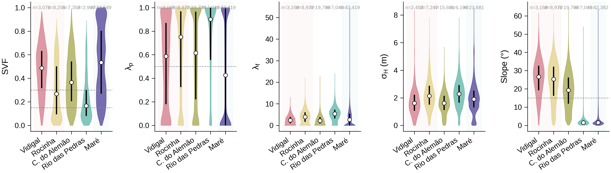

**Figure 2.** Distributions of the five primary indicators (SVF, λp, λf,
σH, slope) across all five sites. Violins show the full distribution per
site; white dots are medians and dark bars span the IQR. Dashed
horizontal lines mark stratum boundaries (SVF at 0.15 and 0.30;
λp at 0.5; slope at 15°). Background shading groups hillside (left,
warm) and flatland (right, cool) sites.

Key patterns:

- **Slope clearly separates typologies.** Hillside sites (Vidigal,
  Rocinha) have most cells at 15–35°; flatland sites (Rio das Pedras,
  Maré) concentrate below 5°; Complexo do Alemão spans both regimes.
- **λp medians span 0.43 (Maré) to 0.90 (Rio das Pedras)** — denser
  than is typical of formal urban fabric. Maré, with its planned-housing
  block interiors, sits at the low end; Rio das Pedras, the densest
  informal infill, at the high end.
- **SVF distributions differ substantially.** Rocinha's dense canopy
  produces a strongly left-skewed distribution (median 0.27); Maré's
  more open layout has a right-skewed distribution (median 0.53).
- **σH is small everywhere** (median 1.6–2.3 m, span across all five
  sites), reflecting the typical 2–3 storey construction.

### 4.4 Spatial visualisation

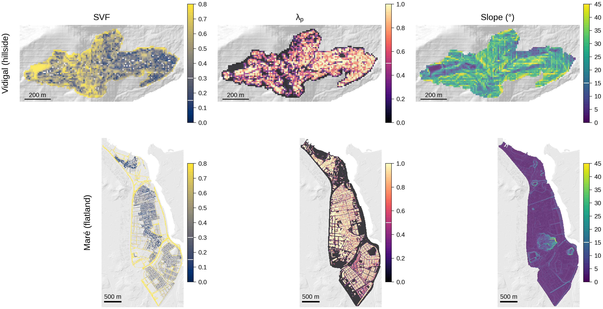

**Figure 5.** Spatial maps of SVF, λp, and slope for Vidigal (hillside)
and Maré (flatland), with hillshade basemap and building outlines. Colour
bars show indicator ranges; white contour lines on colourbars mark the
stratification thresholds.

Notable observations:

- Vidigal's SVF map shows clear low-SVF corridors along the hillslope
  ridgelines where canopy density is highest (dark cyan in upper-left
  panel).
- Maré's λp is near-uniform at 0.7–1.0 across most of the settlement,
  reflecting the tight block structure of the original housing project
  layout.
- Slope maps confirm Vidigal's topography (green-yellow, 20–40°) vs
  Maré's flatness (purple, 0–3° except at engineered berms near the
  bay).

### 4.5 Indicator correlations

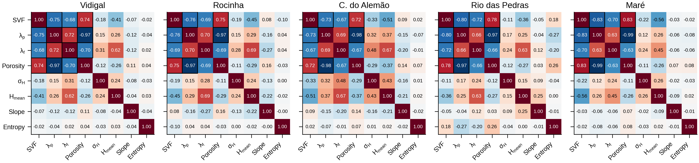

**Figure S1.** Pearson correlation matrices for the eight primary
indicators at each site. Values are annotated in each cell; pairs with
|r| > 0.7 are framed in black. Colour scale is fixed across all panels
so patterns are directly comparable.

- **λp ⇄ porosity** is the strongest correlation everywhere (r ≈ −0.95),
  which motivates dropping porosity from the manuscript's distribution
  figure (Figure 2) to avoid redundancy.
- **SVF ⇄ λp** correlation is strong but not perfect (r ≈ −0.73 to
  −0.83 across the five sites): variation in building *height* and
  arrangement breaks the λp↔SVF link at fine scales. This is the
  structural-coupling finding developed in Section 5.
- **σH correlates weakly with H_mean** (per-site r ≈ 0.15–0.43, pooled
  ≈ 0.34). Earlier prose claimed r ≈ 0.5; the current cross-site number
  is lower because the bimodal "regular block + tall outliers" pattern
  saturates in dense favela fabric.
- **Slope is nearly uncorrelated with morphology**, confirming that
  terrain and urban form are independent stratification axes — a
  necessary condition for the 12-stratum sampling scheme.

### 4.6 Resolution sensitivity

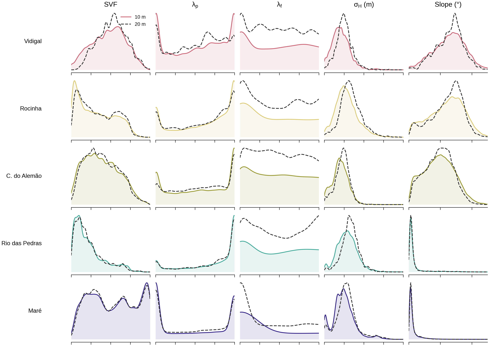

**Figure S3.** 10 m (solid coloured curves) vs 20 m (dashed black
curves) morphometric distributions across all five sites and five
indicators. The 10 m grid captures multimodal structure in λp and λf
that 20 m aggregation smooths away — particularly visible in Complexo do
Alemão and Rio das Pedras where the 20 m curves flatten features that
clearly exist in the 10 m data.

This analysis justifies the 10 m resolution as the production grid:

- The key finding is preserved — distribution shape is similar —
  confirming that 10 m is not noise.
- But fine-scale multimodality relevant to CFD boundary conditions is
  only resolved at 10 m.
- Computational cost at 10 m is manageable (< 85 s per site).

The 20 m grids have been re-baselined onto the dissolved (party-wall-corrected)
λf, so both resolutions now share the canonical estimator; the quantitative
resolution A/B is in §10.9, and the *sensitivity* conclusion (shape
preservation, multimodality only at 10 m) holds on the corrected basis.

Supplementary variants (Vidigal-only upscaled-vs-native scatter, and
side-by-side difference maps) are archived in
`outputs/paper_figures/exports/_variants/` and regenerable with
`figS3_resolution_sensitivity.py --variants`.

---

## 5. Cross-Site Morphology

### 5.1 SVF–λp structural coupling

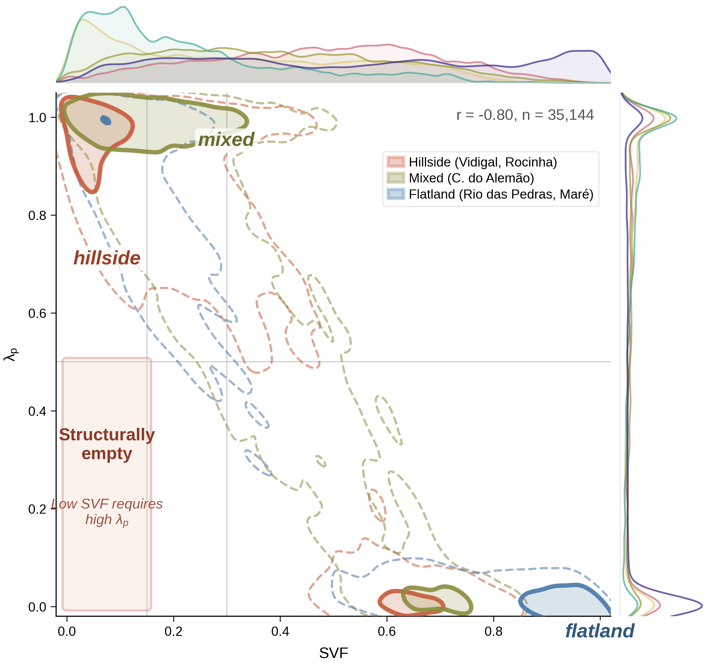

**Figure 3.** Central panel: 2D kernel density estimation of cells in
(SVF, λp) space, grouped by typology. Solid contours enclose 50 % of
each typology's cells; dashed contours enclose 90 %. Terracotta =
hillside (Vidigal, Rocinha); olive-gold = mixed (Complexo do Alemão);
steel blue = flatland (Rio das Pedras, Maré). Marginals show per-site
SVF and λp distributions. The salmon-shaded region in the lower-left
(SVF < 0.15, λp < 0.50) is **structurally empty** — only 102 cells in
35,144 (0.3 %) — because low sky view requires high plan density in
realistic urban fabric. The strong negative correlation (r = −0.80
across all pooled cells) reflects this coupling. The three typologies
occupy distinct but partially overlapping regions of the feature space:
hillside cells cluster at higher λp for a given SVF, consistent with
taller canopies; flatland cells spread to lower λp.

This figure is the central conceptual claim for the manuscript: the
morphology of informal settlements occupies a constrained subset of the
(SVF, λp) plane, and stratified CFD sampling must respect this
constraint (empty strata are not allocation failures but physical
impossibilities).

### 5.2 Typology summary statistics

| Metric | Hillside (VDG+ROC) | Mixed (CDA) | Flatland (RdP+MAR) |
|--------|-------------------:|------------:|-------------------:|
| Slope, median | 25.7° | 19.3° | 1.5° |
| SVF, median | 0.34 | 0.37 | 0.43 |
| λp, median | 0.71 | 0.62 | 0.54 |
| λf_mean, median (built cells, λp > 0) | 1.04 | 0.68 | 0.87 |
| σH, median | 2.0 m | 1.6 m | 2.0 m |

Source: medians computed from the concatenation of
`outputs/{site}/morphometrics/grid/grid_metrics.gpkg` across all grid
cells per site; the λf row restricts to built cells (λp > 0) so that
unbuilt cells — roughly a third of Maré's grid — do not drag the
frontal-area signal of the standing fabric. Note the *Mixed* row reflects only Complexo do
Alemão (which spans both flat and steep terrain — its slope median sits
between the typology extremes); aggregating it with either Hillside or
Flatland would compress that signal.

Two observations matter for the CFD design. First, **λp is uniformly
high (0.54–0.71)** across all three typologies — informal urban form is
denser than formal Rio fabric (typical λp in Copacabana ≈ 0.40), so the
sampling allocation correctly prioritises high-λp strata. Second,
**on the built fabric, hillside and flatland typologies carry comparable
median λf (1.04 vs 0.87)**; the Mixed typology dips (0.68) because
Complexo do Alemão has the lowest building heights of the campaign
(mean H_mean = 5.3 m). (All λf values reflect the 2026-06 dissolved /
party-wall-corrected re-baseline — see §4.2; on an all-cells basis the
flatland median drops to 0.63 because of Maré's unbuilt share.) Wind-canopy drag
will therefore not separate cleanly along the hillside↔flatland axis;
SVF and slope are the dominant discriminators that CFD will quantify.

**Flow regime from λf.** Against the Oke / Grimmond–Oke thresholds — isolated
roughness λf < 0.15, wake interference 0.15 ≤ λf < 0.65, skimming flow λf ≥ 0.65 —
the favela fabric is **predominantly skimming flow**: pooled across built cells,
65 % skimming, 30 % wake interference, 5 % isolated (cell median λf ≈ 0.83,
dissolved). Read this as a regime classification, not a ventilation grade:
**geometry classifies the flow regime but cannot grade per-cell ventilation
adequacy** — that requires the CFD age-of-air τ (Tier 2, pending). The at-scale
statement is therefore that *the fabric is predominantly in the skimming-flow
regime*, not a per-cell ventilation-deprivation grade.

### 5.3 SVF and solar access decouple on sloped terrain

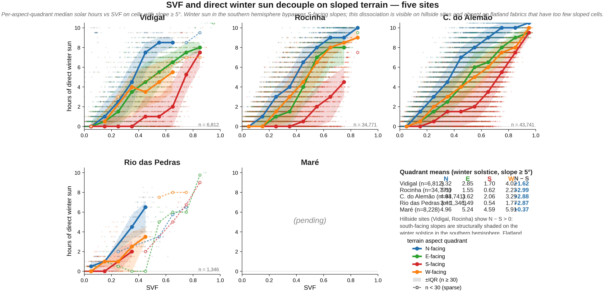

**Figure 6.** Per-quadrant median **winter-solstice** solar hours as a
function of SVF, on every site's sloped cells (slope ≥ 5°). Each panel
holds a single site: four traces (N / E / S / W) plus the underlay
scatter coloured by aspect bearing. Shaded bands show the
inter-quartile range; trace segments where the SVF bin contains fewer
than 30 cells are dashed (open markers) to flag the small-sample
tails. All five sites show the same ordering — the N trace sits above
the S trace at every SVF — but the magnitude tracks typology: the
per-site quadrant means (full table below) give an N − S contrast of
+2.6 to +2.9 h across the hillside sites (Complexo do Alemão highest at
+2.92 h) down to +0.37 h on flatland Maré, whose near-level fabric mutes
the dissociation without reversing its sign.

The headline scientific claim, now cross-site: **SVF and solar hours
are not interchangeable on sloped terrain in the southern
hemisphere.** SVF measures total sky visibility; the winter sun in
Rio (~22°S) crosses the sky to the north, so a south-facing cell can
have abundant sky visibility while pointing away from the sun's
actual path. The W quadrant earns the most direct sun by catching the
late-afternoon descent into the north-west horizon; the S quadrant is
structurally shaded for the entire winter solstice day. This
dissociation is *not* a hillside-only phenomenon: Rio das Pedras has
only ≈ 1.3 k street points above the 5° threshold (vs ≈ 35–44 k on
the hillside sites) but those few sloped cells reproduce the same
+2.9 h N − S contrast. The dissociation is southern-hemisphere
physics; the typology controls only how many cells experience it. The
§7 CFD regression therefore uses aspect (via `(sin α, cos α)`) and
aspect–wind alignment alongside SVF as distinct predictors, rather
than collapsing them.

The same data is shown spatially in
[Figure S — terrain-aspect spatial expression](figures/figS_terrain_aspect_spatial.png),
which maps four encodings of the Vidigal street-point set: terrain
aspect (compass-coloured), SVF, solar hours, and the disagreement map
SVF − solar (RdBu_r). Panel (d) of the supplementary figure is
red-dominant across most of the favela: sky is open but the winter sun
does not reach.

Cross-site quadrant means on sloped cells (winter solstice, 30-min
sampling, ray-cast against terrain + extruded LiDAR-height footprints):

| Site | n | N | E | S | W | N − S |
|---|--:|--:|--:|--:|--:|--:|
| Vidigal | 6,812 | 3.00 | 2.81 | 1.63 | 3.89 | +1.37 |
| Rocinha | 33,463 | 3.22 | 1.45 | 0.61 | 1.98 | +2.61 |
| Complexo do Alemão | 43,741 | 4.97 | 3.63 | 2.05 | 3.27 | +2.92 |
| Rio das Pedras | 1,346 | 3.41 | 1.47 | 0.53 | 1.76 | +2.87 |
| Maré | 8,228 | 4.96 | 5.24 | 4.59 | 5.91 | +0.37 |

Direct regression of solar hours on `(slope, λp, sin α, cos α)` on
Vidigal reaches R² = 0.270 (n = 6,876, intercept 5.52 h,
`aspect_cos` coefficient = +1.13 — i.e. moving from S- to N-facing
under fixed slope and λp adds 2.3 h on average). Per-site SVF
regressions on `(slope, λp, sin α, cos α)` are written to
`outputs/{site}/morphometrics/aspect_regression.csv` (Vidigal SVF
R² = 0.599) with per-quadrant summaries in
`aspect_quadrant_summary.csv`. Cross-site signal: Vidigal sloped grid
cells show SVF means N = 0.38 / E = 0.44 / S = 0.51 / W = 0.57 — the
S/W cells have *more open sky* yet the figure shows them receiving
*less winter sun*, which is exactly the dissociation point.

### 5.4 Seasonal envelope: the worst-case figure understates summer recovery

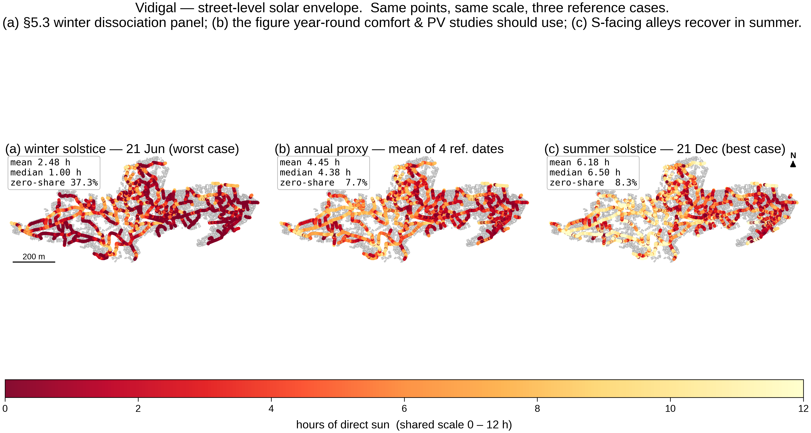

**Figure 7.** Three street-level solar maps on the same point set,
same scale. (a) Winter solstice (worst case, mean 2.59 h, 36.5 % of
points fully shaded). (b) Annual proxy: unweighted mean of four
reference dates — winter and summer solstices plus March and September
equinoxes (mean 4.53 h, 7.7 % fully shaded). (c) Summer solstice
(best case, mean 6.21 h, 8.3 % fully shaded). Computed by
`scripts/run_street_solar.py` (30-min sampling, 5 h–19 h window,
pvlib sun positions, ray-cast against `scene.stl` = DTM + extruded
LiDAR footprints), with all four per-date arrays plus annual-mean
columns written into a single
`outputs/vidigal/morphometrics/svf/svf_streets_solar.gpkg`.

The seasonal swing on Vidigal is large enough that a winter-only
analysis substantially understates summer access: 42.4 % of street
cells gain ≥ 4 hours and 28.2 % gain ≥ 6 hours between winter and
summer solstice, and 1,564 of the 2,510 winter-zero-hour cells (62 %)
recover to ≥ 2 h in summer. Mean seasonal range across all street
cells is 4.25 h. Under the WHO 2-hour daily-sunlight benchmark, 54.1 %
of Vidigal's street cells fall short on the winter solstice but only
19.3 % on the summer solstice; **the year-round figure to use for
comfort, photovoltaic, and health-outcome studies is the annual proxy
(28.6 % below 2 h)**, not the winter worst case.

The same envelope was extended to all five sites in May 2026
(`scripts/run_street_solar.py` + `outputs/paper_figures/figS_solar_envelope.py`,
both site-agnostic — the canonical fig07 wrapper for Vidigal is a
4-line invocation of the same renderer). Per-site envelope panels are in the
SI (`figures/figS_solar_envelope_{rocinha,complexo_do_alemao,riodaspedras}.png`).
Cross-site headline numbers:

| Site | n streets | winter h | annual h | summer h | WHO < 2 h winter | WHO < 2 h annual | WHO < 2 h summer | range h |
|------|--:|--:|--:|--:|--:|--:|--:|--:|
| Vidigal | 6,876 | 2.59 | 4.53 | 6.21 | 54.1 % | 28.6 % | 19.3 % | 3.62 |
| Rocinha | 38,690 | 2.08 | 3.30 | 4.56 | 67.1 % | 49.1 % | 34.1 % | 2.48 |
| Complexo do Alemão | 47,508 | 3.22 | 5.03 | 6.66 | 44.2 % | 20.9 % | 12.9 % | 3.45 |
| Rio das Pedras | 16,905 | 1.99 | 3.14 | 4.22 | 62.5 % | 44.0 % | 29.7 % | 2.23 |
| Maré | 84,147 | 5.20 | 7.07 | 8.70 | 27.8 % | 9.9 % | 5.3 % | 3.50 |

Two structural patterns:

* **Hillside vs flatland seasonal range.** Vidigal (3.62 h) and CDA
  (3.45 h) have the largest winter→summer recoveries — terrain shadowing
  on hillside structures depresses the winter floor harder, which the
  high summer sun then erases. The flatland sites recover less in
  absolute terms (Rocinha 2.48 h, RdP 2.23 h, Maré 3.50 h)
  because their winter floor was less depressed: the fabric is denser
  and shadowing is canyon-driven rather than terrain-driven, so summer
  doesn't lift the worst cells as far.

* **WHO benchmark gap.** Even on the annual proxy, Rocinha and Rio das
  Pedras leave 49 % and 44 % of street cells below the WHO 2 h/day
  threshold. CDA and Vidigal sit at 21 % and 29 %. **Annual mean is the
  number that should drive comfort and health-outcome modelling**; the
  winter worst case (44–67 % below WHO) is the conservative bound for
  PV-siting and seasonal-affective studies, not the everyday figure.

Cross-site comparison by aspect quadrant:

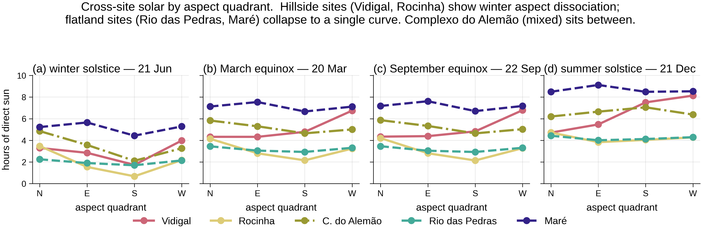

**Figure 8.** Mean street-level direct sun by aspect quadrant
(N / E / S / W) and reference date. Hillside sites (Vidigal, Rocinha)
show large winter N–S contrasts (Rocinha N − S = +2.44 h; Vidigal
+1.31 h) — the §5.3 dissociation made cross-site. Flatland sites
collapse: Rio das Pedras' winter N − S contrast is just +0.56 h
(Maré +0.79 h). Complexo do Alemão's mixed terrain shows a
hillside-like +2.78 h winter contrast.

The standalone single-panel versions of Figure 7 (a/b/c) live at
`docs/technical_report/figures/fig07a_solar_winter.png`,
`fig07b_solar_annual.png`, and `fig07c_solar_summer.png`; they
re-export from
`outputs/paper_figures/fig07_solar_envelope_vidigal.py` and use the
shared 0–12 h colour scale from that script for direct visual
comparison.

---

### 5.5 Morphological Typology & Signature

*Track `track/morphotope`. Full walkthrough with all figures: the project hub's
"Morphology overview". Code: `src/morphometry/{signature,morphotope,configuration}.py`.*

Beyond the cross-site distributions of §5, the fabric clusters into a small,
recurrent set of **morphotypes** — a favela morphological signature. The pipeline
clusters a lean, standardized cell-level fabric vector (λp, H_mean, σH, λf_mean,
λf anisotropy, slope) with a Gaussian mixture (k = 6) over the ~64,000
built campaign cells. **On the choice of k:** internal-validity indices (silhouette,
Calinski-Harabasz, Davies-Bouldin) favour a coarser k = 2–3 — geometry alone cleanly
separates only a few broad groups — so **k = 6 is a domain-driven granularity chosen
for morphological interpretability, not a distance-based optimum** (Calinski-Harabasz
does peak at k = 6). Its justification is *cross-site reproducibility*: leave-one-site-out
refits recover the six-type labelling at ARI 0.763 (bootstrap ARI 0.90), and the held-out
experience gradient (below) is monotone in it. The clustering was re-fit on the
**dissolved (party-wall-corrected) λf** (§4.2); membership differs from the previously-published
summed-λf typology (cross-version ARI 0.23), so the type identities below were re-derived. The six types order along a **density → enclosure spine
crossed with a flat/steep switch**: T0 Open Fringe, T1 Flatland Consolidated
(flatland-specific), T2 Hillside Fringe, T3 Shaded Consolidated, T4 Hillside Core,
T5 Saturated Core (flatland-specific, λp = 1.0).

*This section presents **two linked but distinct classifications**: the cell-scale
**morphotype** (T0–T5; Figures 5.5a–d) and the block-scale **morphotope** (M0–M2;
Figure 5.5e). The cell is the unit of measurement; the morphotope is the unit of
signature. They use deliberately non-overlapping names and never share a label.*

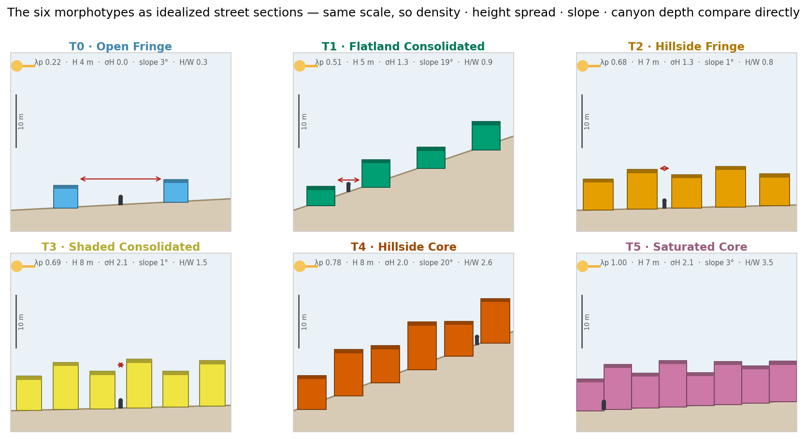

*Figure 5.5a — **cell-scale morphotypes (T0–T5)**, the six cell types as idealized, same-scale street sections.*

**Validation is two-fold.** (i) *Cross-site recurrence*: **T4 Hillside Core is
universal (5/5 sites) and the dominant hillside type (~50 % of hillside cells); T0,
T2, and T3 recur** across ≥3 favelas; **T1 and T5 are flatland-conditional** (present
only where flat buildable land exists — the cell typology is not fully universal at
cell scale, which motivates the block scale below). The composition is topographic —
hillside favelas (Vidigal, Rocinha, Complexo do Alemão) are dominated by the Hillside
types (T2/T4), the flatter Rio das Pedras and Maré by the flat-dense types (T1/T5).
(ii) *Held-out experience*: the
experienced conditions never entered the clustering, yet worsen monotonically along
the type spine — the fraction of observers below the WHO 2 h winter-sun floor climbs
0 → 1.0 from T0 to T5. **Caveats:** SVF is geometrically coupled to the clustering
inputs (SVF ≈ f(λp, H/W); excluded from the fabric set for that reason, §4.2), so the
**winter-sun / WHO-failure** outcomes — which depend on solar geometry and terrain,
not just density — are the cleaner held-out signal; and the experience profiles are
read on supported cells only (~35 % of cells carry a street observer; per-type
support 0.23–0.59, lower for the open types). Bootstrap cluster stability (k = 6) is
high (ARI 0.90).

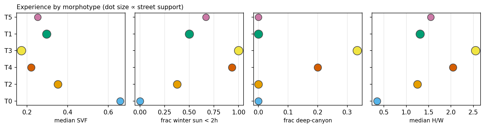

*Figure 5.5b — held-out experienced conditions per **cell morphotype (T0–T5)** (the clustering never saw these); they worsen monotonically with density — out-of-sample confirmation.*

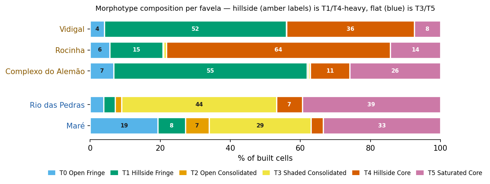

*Figure 5.5c — **cell-morphotype (T0–T5)** composition per favela; topography drives the mix.*

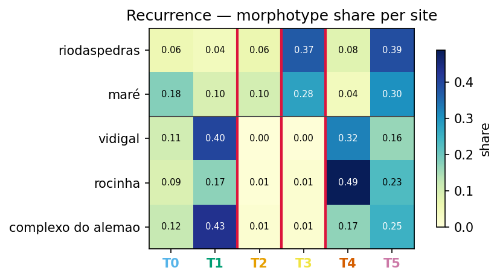

*Figure 5.5d — **cross-site recurrence** of the cell morphotypes (validation (i)): T4 Hillside Core is universal (5/5 sites); T0, T2, T3 recur across ≥3 favelas; T1 and T5 are flatland-conditional. The recurring core is what makes the typology a signature rather than a per-site artefact.*

**Block-scale morphotopes.** *Two distinct classifications are used and must not be
conflated:* the **morphotype** is the cell-level alphabet (T0–T5, six classes, the
unit of measurement); the **morphotope** is the block-level tissue (M0–M2, three
classes, the unit of signature), and the two use deliberately non-overlapping names
(cell: Open/Hillside Fringe, Flatland/Shaded Consolidated, Hillside/Saturated Core;
tissue: Compact Hillside, Mixed Dense, Saturated Flatland). A single 10 m cell is the
measurement unit, but a favela *signature* is a block-scale tissue. Clustering each
cell's morphotype composition over a 50 m window yields **k = 3 morphotopes**
(bootstrap stability ARI 0.916, min 0.810): **M0 Compact Hillside Tissue** (71 % T4
Hillside Core + 22 % T2; recurs, 4 sites), **M1 Mixed Dense Tissue** (the most diverse
tissue — 41 % T5 / 34 % T4 / 14 % T0), and **M2 Saturated Flatland Tissue** (94 % T5
Saturated Core; flatland-specific, 2 sites). Two of three recur across ≥3 sites — a
stronger, less artefact-prone recurrence claim than the cell scale, and one that
resolves whether the flat-dense cell-types are real (the Saturated-Core *cell type*
concentrates inside the coherent, recurring *Saturated Flatland tissue*, M2).

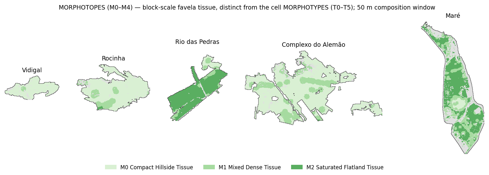

*Figure 5.5e — **block-scale morphotopes (M0–M2)**, the tissue classification (a separate, coarser level than the cell morphotypes in 5.5a–d): the favela signature as coherent tissue.*

**Configuration.** A party-wall adjacency metric (fraction of each footprint's
perimeter fused to a neighbour) captures the relational fabric the intensity vector
misses: favela buildings are fused everywhere (median 0.6–1.0, vs ≈0.1 for detached
formal blocks), and — orthogonally to density — the flat types are near-fully
party-walled while the hillside types are more stepped. **Forward look (forthcoming;
not in this report):** this typology is the basis for a morphology-only *predictor of
environmental failure*. The per-type WHO-2 h sun-failure rate separates strongly
(≈ 13 % in the Open Fringe to ≈ 63–68 % in the hillside/shaded cores), but the full
sub-study finds that the **continuous fabric vector — not the discrete code —
carries the transferable signal** (leave-one-site-out AUC-PR 0.84 vs 0.61 for the
type code alone); the typology is best read as a descriptive, coarse prioritiser,
with a blind risk map applied to the three calibration favelas. The parsimony,
calibration, and blind-application detail is in the typology-predictor plan.

**Shape/grain is a separable additive axis, not density re-expressed (A/B sensitivity).**
The canonical signature is built on a density-anchored six-feature vector
(λp, H̄, σ_H, λf, λf-anisotropy, slope); the `morphotype` / `morphotope` /
`morphotype_smooth` partitions and every λf value are frozen bit-for-bit. As an
*additive A/B sensitivity* — never a re-baseline — we re-fit the GMM (k = 6) on the
canonical vector augmented with per-building shape and grain descriptors
(area-weighted convexity, building adjacency, elongation, tessellation-neighbour
count, fractal dimension, plus a within-cell grain axis `area_entropy`). A VIF
screen drops `shape_index_mean` (VIF = 10.45 ≥ 10) as collinear with density — it
merely re-expresses λp, the known confound — and keeps the six remaining axes
(convexity 5.89, elongation 6.47, building_adjacency 1.76, tessellation 1.12,
fractal_dimension 1.19, area_entropy 1.47). The shape-augmented partition is
*genuinely different* from the canonical one: cell-level ARI(shape vs canonical) =
0.175 (LOSO mean 0.181, min 0.130 at Rio das Pedras) over 39,888 shared cells — a
partition that merely re-encoded density would land near ARI ≈ 1, so an ARI near
0.18 means the screened grain/convexity/adjacency axes reshuffle a large fraction of
cells into different types. At tissue scale the agreement rises to ARI = 0.436
(k = 5 morphotopes built from each label field): the ~50 m composition window
absorbs much of the cell-level churn, so the recurrent-tissue signature is again the
more robust scale. The low ARI is the finding, not a defect — it quantifies how much
fabric *character* is orthogonal to the density field the canonical signature is
built on. *Decision:* keep the density-anchored six-feature fit as the canonical
signature and report `morphotype_shape` as a shape-sensitivity extension only.
*(Provenance: `outputs/cross_site/signature/shape_ab_meta.json`,
`shape_vif.csv`, `outputs/cross_site/morphotope_stability/shape_morphotope_ari.json`;
decision-log D22.)*

**Hardening the predictor flip: spatially-blocked CV, block-bootstrap CIs, and an
external blind map.** The forward-look finding above — that the *continuous fabric
vector*, not the discrete type code, carries the transferable signal (leave-one-site-out
AUC-PR 0.84 vs 0.61 for the type code) — is hardened here. Transfer is evaluated under
spatially-blocked leave-one-site-out CV (each test favela is held out whole), and the
pooled out-of-fold AUC-PR is banded by a site-block bootstrap that resamples the five
favelas with replacement (B = 2000): vector 0.86 [0.76, 0.93], type 0.55 [0.48, 0.77].
With only five site blocks the bands are wide and **overlapping** — the vector-minus-type
gap is *not* statistically separated (`gap_vector_minus_type_ci_separated = false`). The
honest reading is therefore a **direction** (the continuous vector transfers better than
the discrete code), not a cleanly separated gap; the headline 0.84 / 0.61 point estimates
stand, but the confidence bands at n = 5 sites are too wide to certify the margin. The
continuous fabric vector itself is low-collinearity (VIF 1.1–3.0: λp 1.68, λf 3.00,
H̄ 2.26, σ_H 1.30, slope 1.09 — no SVF, no solar term), so the transfer is not riding on
a redundant predictor. As a genuinely external check, the trained predictor is applied
*blind* to three calibration favelas it was never fitted on (Borel, Jacarezinho,
Morro do Juramento), producing a per-building risk map (Figure 5.5f): pooled AUC-PR 0.76
and Brier 0.20 over 3,797 buildings, but site-variable (AUC-PR 0.82 at Jacarezinho vs
0.39 at Morro do Juramento) with a large out-of-envelope fraction at some sites — so the
blind map is flagged as *extrapolation*, a coarse prioritiser rather than a per-building
guarantee. As with the geometric ventilation tendencies elsewhere in this report, these
remain τ-gated, geometry-only descriptors: they are not a claim of per-cell ventilation
adequacy, which awaits CFD integration.
*(Provenance: `outputs/cross_site/typology_predictor/spatial_cv.json`,
`outputs/cross_site/typology_predictor_extra/blind_riskmap_validation.csv`,
`blind_riskmap_summary.csv`.)*

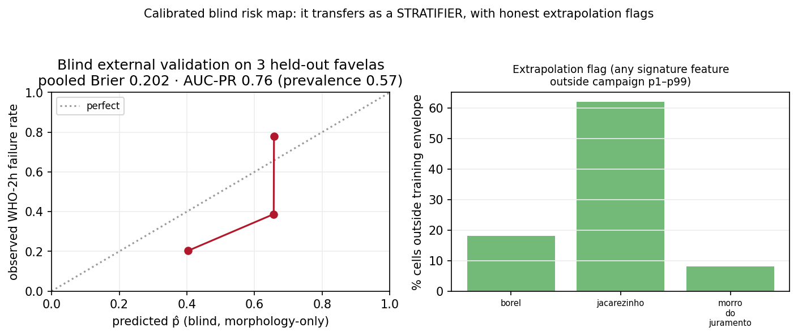

*Figure 5.5f — **external blind validation** of the continuous-fabric-vector predictor on three favelas it was never fitted on (Borel, Jacarezinho, Morro do Juramento): pooled AUC-PR 0.76, Brier 0.20 over 3,797 buildings, but site-variable and extrapolation-flagged. A direction, not a per-building guarantee.*

---

### 5.6 Geometric ventilation tendencies (τ-gated, pre-CFD)

*Code: `scripts/run_lateral_connectivity.py`, `scripts/run_ventilation_susceptibility.py`,
`scripts/run_wind_exposure.py`. Data: `outputs/paper_figures/{lateral_connectivity,
ventilation_susceptibility,wind_exposure}.json`.*

Three additive geometric scalars complement the λ$_f$ vertical flow regime of §4.2
with two more degrees of ventilation freedom — lateral depth and directional
exposure. **All three are strictly geometric *tendencies*, not air-exchange
adequacies.** The defensible per-cell ventilation outcome is age-of-air τ, which is
CFD-gated and supersedes every scalar here (§10.2); these maps are read only as a
pre-CFD prioritisation surface, never as a claim that a given cell is or is not
adequately ventilated. They are reported because they are the independent
ventilation signals available from geometry alone before the OpenFOAM campaign
lands.

**(1) Lateral connectivity — depth into contiguous fabric.** For each built 10 m
cell, the Euclidean distance (via a distance transform on the built mask, with a
1-cell open border so the settlement perimeter counts as open) to the nearest open
cell — an interior unbuilt cell or the exterior. Deeper cells are farther from any
opening, so lateral inflow must penetrate further; this is the *lateral* companion
to λ$_f$'s *vertical* signal. The pooled built-cell median depth is **31.6 m**, rising
to a maximum of **232.6 m** in Maré, the largest and most contiguous fabric; the
flatter, more fragmented Vidigal sits shallowest (median **22.4 m**) and the dense
Rio das Pedras deepest (median **42.4 m**). The two axes are positively coupled at
the cell level — pooled Spearman ρ(open-edge depth, λ$_f$) = **+0.487** (p ≈ 0) —
so deeper cells also tend to sit in the skimming regime: the fabric is *doubly
constrained*, not trading vertical suppression for lateral access.


*Figure 5.6a — lateral-connectivity tendency (depth to nearest open edge); pooled median 31.6 m.*

**(2) Ventilation susceptibility — regime × depth.** The vertical and lateral
signals are crossed into a 3×2 bivariate class (λ$_f$ regime — isolated/wake/skimming
— against depth split at the pooled median **31.6 m**), kept as *two separate axes,
never summed into a single index*. The worst geometric class is **skimming ∩ deep**
(vertically suppressed *and* laterally buried), which holds a pooled **41.8 %** of
built cells — the same fraction as the joint deep-and-skimming count above, since
both read off the median split. Its share tracks density and contiguity: highest in
Rio das Pedras (**59.6 %**) and Rocinha (**54.6 %**), lowest in Vidigal (**30.8 %**).


*Figure 5.6b — geometric ventilation susceptibility (regime × depth); pooled skimming ∩ deep share 41.8 %.*

**(3) Effective wind exposure — directional λ$_f$ weighted by the wind rose.** Each
cell's 8-sector frontal-area density is weighted by the measured wind-rose frequency
(§2.3), exposure = Σ$_θ$ freq(θ)·λ$_f$(θ). Because λ$_f$ is exactly 180°-symmetric,
this is a frequency weighting of the four cross-wind axes — it captures *how often the
fabric blocks the prevailing wind*, never channelling or sheltering. The diagnostic
is the ratio to the isotropic baseline (exposure ÷ λ$_f$ mean): the pooled ratio is
**near-isotropic** — median **1.007**, mean **0.994** — meaning the prevailing wind
on average meets neither a markedly more open nor a more blocked face than a uniform
rose would. Site alignment varies modestly with the dominant sector: Vidigal (E,
30 %) sits slightly sheltered (ratio median **0.950**) while Rio das Pedras (SW, 26 %)
and Maré (SE, 26 %) are marginally more exposed (**1.010**). The practical reading is
that directional fabric alignment is a second-order effect at these sites; the
first-order ventilation constraints are the regime and depth of (1)–(2).


*Figure 5.6c — effective wind-exposure tendency; pooled exposure-to-isotropic ratio median 1.007 (near-isotropic).*

Taken together, the three scalars frame the favela fabric as vertically suppressed
and laterally deep in a coupled way, with directional exposure only a minor
modulation. None of this is an air-exchange verdict: the cells flagged here are
*candidates* for poor ventilation, and the CFD age-of-air field (§10.2, §11) remains
the arbiter.

---

## 6. CFD Patch Sampling

### 6.1 Sampling design

Each CFD simulation corresponds to one **analysis patch** of interest
— a 100 m-diameter circle (radius 50 m, area ≈ 7 854 m²) — embedded in
a per-direction rectangular domain whose extents follow the
Franke / COST 732 / Tominaga 2008 / Blocken 2015 wide-obstacle scheme
(see §6.5 and `src/cfd_integration/rectangular_domain_v1.json`). The
circular patch shape is independent of the rectangular mesh: it avoids
corner artefacts in morphometric averaging, gives isotropic coverage
independent of building-grid orientation, and is symmetric across all
8 wind-direction meshes. To characterise the morphological diversity
of the five sites with a finite simulation budget, patches are
allocated across **twelve stratification bins**:

- SVF: 3 bins (SVF < 0.15, 0.15 ≤ SVF < 0.30, SVF ≥ 0.30)
- Slope: 2 bins (< 15°, ≥ 15°)
- λp: 2 bins (< 0.5, ≥ 0.5)

giving 3 × 2 × 2 = 12 strata, named e.g. `SVF1_SLP2_LP2` for
SVF < 0.15 + slope ≥ 15° + λp ≥ 0.5.

### 6.2 Eligibility filter

A cell is an eligible patch centre if:

1. The CFD source-data envelope (rotated worst-case rectangle, half-
   diagonal `√((10·H_max + R_patch)² + lateral²) + 50 m` per the v1
   manifest) is fully covered by available building data. The original
   sampler used a 250 m-radius proxy at sampling time; the post-hoc v1
   audit (`scripts/audit_rectangular_domain.py`) re-checks every
   campaign patch against the rectangular envelope using the 700 m
   extended-context buffer (§3.2, §6.5).
2. Within the 100 m-diameter circular analysis patch, building
   footprint coverage (∑ intersection area ÷ π·50² ≈ 7 854 m²) ≥ 0.5.
   This also implicitly rejects patches clipped by the site boundary,
   where the missing area fails the coverage threshold.
3. All three stratification indicators are non-null.

Filter outcomes per site:

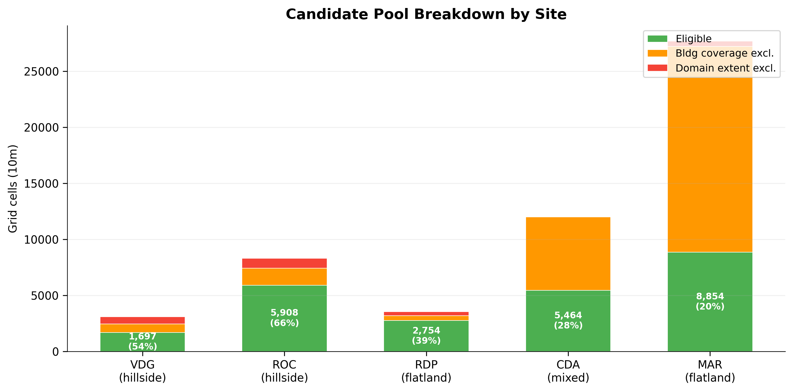

**Figure (candidate pool).** Stacked bars showing eligible cells (green)
vs excluded cells per filter. Two exclusion sources: domain-coverage
failure (red, dominated by edge cells in Vidigal and Rio das Pedras)
and low-building-coverage failure (orange, dominant in Maré because of
large residential block interiors without continuous footprint).

With the 300 m building-context extension, the domain-coverage
exclusion drops from 55 % (no extension) to 0–20 % depending on
settlement shape. The remaining exclusions are legitimate morphology:
Maré's 20 % overall eligibility rate reflects its lower footprint
coverage per 100 m patch, not a sampling artefact.

### 6.3 Selection algorithm

For each site, patches are chosen in two phases:

**Phase 1 — Pilot (12–15 patches per site).** Within each non-empty
stratum, at least one patch is allocated; an additional bonus is given
to the three most populated strata. Patches are chosen by **greedy
maximin geographic distance** starting from the two most distant
eligible cells; subsequent picks maximise minimum distance to already-
selected patches (and to patches of other strata selected earlier, so
that the cross-stratum spacing constraint is respected). Minimum
spacing: 80 m between patch centres. With 100 m-diameter patches, two
patches at the minimum centre-to-centre distance overlap in a lens of
≈ 817 m² (≈ 10.4 % of each patch area); this residual overlap is
accepted because the patches are evaluated independently in separate
CFD simulations and no joint statistics are computed over overlapping
footprints.

**Phase 2 — Campaign (incremental to 22–25 patches per site).** Pilot
patches are held fixed and treated as immovable seeds; additional
patches are chosen with **SVF-priority weighting** to oversample the
health-relevant low-SVF strata:

- SVF1 (< 0.15) → ×2.0 multiplier
- SVF2 (0.15–0.30) → ×1.0
- SVF3 (≥ 0.30) → ×0.8

The effective allocation is proportional to the weighted eligible count
per stratum, subject to per-stratum minimums (≥ 1 patch if any cells
exist) and the 80 m spacing constraint against the union of pilot and
newly-selected patches.

Implementations: `scripts/run_pilot_sampling.py` (Phase 1),
`scripts/run_campaign_sampling.py` (Phase 2),
`scripts/build_extended_context.py` (upstream).

### 6.4 Allocation results

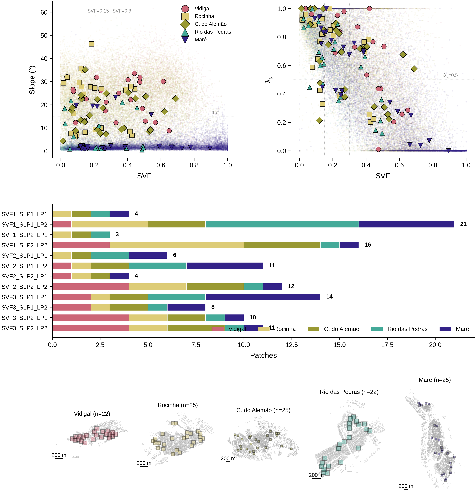

**Figure 4.** (a–b) Feature-space coverage of the 119 selected patches
over the full grid-cell cloud for (SVF, slope) and (SVF, λp) axes.
Dotted lines mark stratum boundaries. (c) Horizontal bar chart of
patches per stratum, with segments coloured by site; numeric labels
give the stratum total. (d) Per-site maps showing analysis-patch
locations as coloured 100 m-diameter circles over grey building
footprints. All five sites shown at consistent visual scale with 200 m
scale bars.

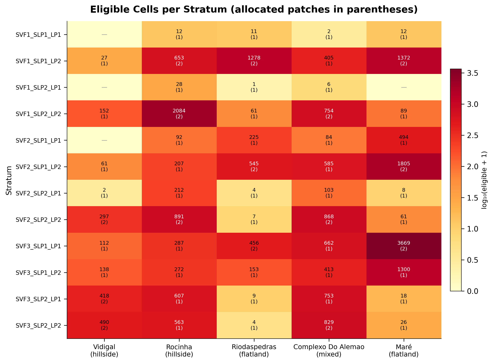

**Figure (strata heatmap).** Matrix of eligible cell counts (log₁₀
scale) and allocated patches per stratum per site. Cells with no
eligible candidates are marked with an em-dash. This makes the
partial-empty structure explicit: three strata are empty at one or more
hillside sites (SVF1_SLP1_LP1, SVF1_SLP2_LP1, SVF2_SLP1_LP1) because
Vidigal's narrow hillside settlement has no flat cells with sparse
footprints.

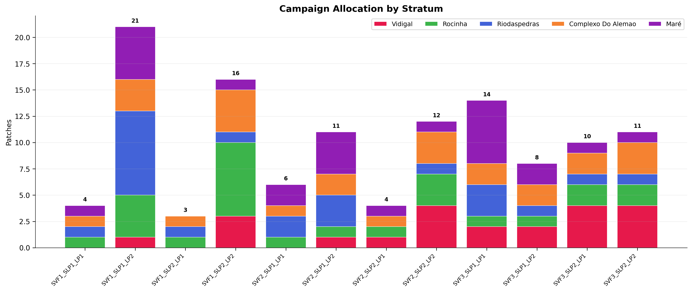

**Figure (campaign allocation).** Total patches per stratum in the
final 119-patch campaign, segments coloured by site. SVF1_SLP1_LP2
(low sky view, flat, dense) has the highest patch count (20) after
SVF-priority weighting — this is the stratum most relevant to health
outcomes at the flatland sites and was intentionally oversampled.

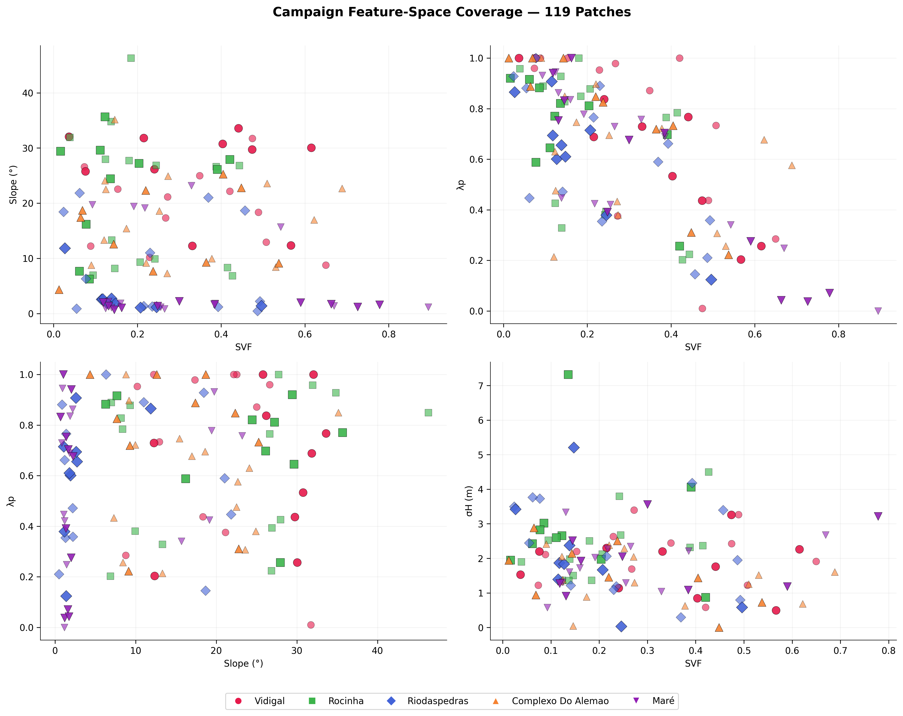

**Figure (cross-site feature space).** All 119 patches overlaid on all
five sites' grid-cell clouds across four feature-space projections
(SVF vs slope, SVF vs λp, slope vs λp, SVF vs σH). Site colours match
throughout. Verifies that sampled patches span the full morphological
envelope of the five sites without clustering in any projection.

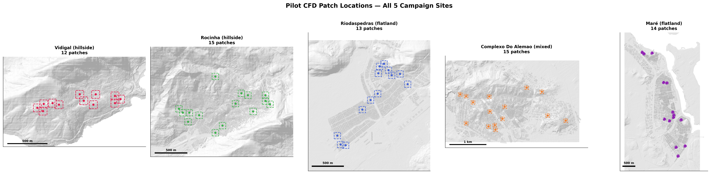

**Figure (all sites overview).** 5-panel map of final patch locations
per site, each with hillshade basemap and patch outlines in site colour.

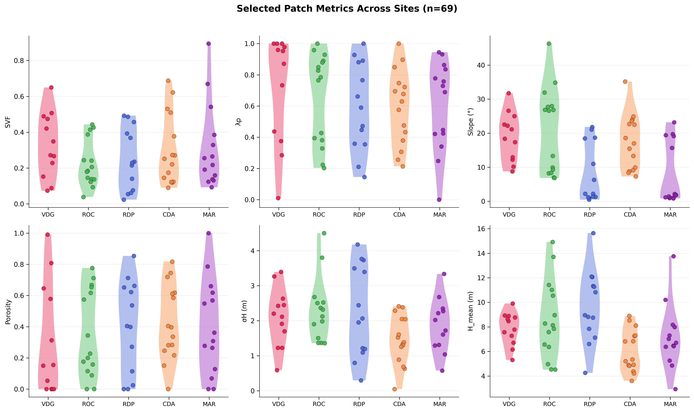

**Figure (patch metrics).** Violin plots of morphometric values at the
119 selected patches, grouped by site. Confirms that the selection does
not over-represent or under-represent any single site's typical
conditions: each site's patch distribution spans its full grid-cell
distribution for each indicator.

Final per-site allocation:

| Site | Pilot | Campaign add | Total | Shortfall |
|------|------:|-------------:|------:|----------:|
| Vidigal | 12 | 10 | 22 | 0 |
| Rocinha | 15 | 10 | 25 | 0 |
| Rio das Pedras | 13 | 9 | 22 | −1 |
| Complexo do Alemão | 15 | 10 | 25 | 0 |
| Maré | 14 | 11 | 25 | 0 |
| **TOTAL** | **69** | **50** | **119** | **−1** |

Rio das Pedras has a one-patch shortfall against its 23-patch target:
the SVF2_SLP2_LP2 stratum has only 7 eligible cells, all within 80 m
of existing pilot patches, so no additional candidate could be placed
without violating the minimum-spacing constraint. This is a genuine
morphological limitation (the stratum is physically scarce) and was
accepted rather than relaxing the spacing.

### 6.5 Rectangular per-direction domain compliance

The CFD methodology adopted in May 2026 is rectangular per-direction
(one `blockMesh` per patch × wind-direction pair) per Franke et al.
(2007) / COST 732 / Tominaga et al. (2008) AIJ / Blocken (2015). The
canonical rule set is `src/cfd_integration/rectangular_domain_v1.json`.
Domain dimensions per patch:

```
upstream    = 5 · H_max + R_patch
downstream  = 15 · H_max + R_patch
lateral     = max(5 · H_max + R_patch,  5 · W_patch)   each side
top         = 5 · H_max
```

with R_patch = 50 m (analysis-circle radius) and W_patch = 100 m
(diameter). Because all 119 patches have H_max < 90 m, the lateral
floor of `5 · W_patch = 500 m` dominates, and the silhouette-envelope
blockage `D · H_max / (2 · lateral · top)` collapses to a *uniform*
2 % across the campaign — independent of H_max, well under the 5 %
AIJ gate (Tominaga 2008). All 119 patches pass blockage at this gate.

The rotated-rectangle source-data envelope (a single radius per patch
that covers all 8 wind-direction meshes) ranges 565–646 m across the
campaign, with the maximum at RDP-P15 (`H_max_analysis = 27.3` m). The
extended-context layer was extended from 300 m to 700 m on all five
sites (`buildings_extended_700m.gpkg` / `dtm_extended_700m.tif`) in
the same migration. After the buffer extension all 119 patches are
eligible — *no patch was dropped or replaced*, the campaign list is
intact.

The earlier cylindrical-domain rule (radius 250 m, Blocken minimum
fetch `5 × H_max`) is deprecated. The indicator column
`blocken_radius_required` was dropped from both
`outputs/{site}/sampling_cfd/campaign_sampling/campaign_patches.csv`
and `outputs/{site}/cfd_analysis/per_patch_indicators.csv` and
replaced by a per-row `domain_*_m` set (upstream, downstream, lateral,
top), `domain_blockage_ratio` and `domain_blockage_ok`,
`source_data_required_m`, `source_data_extent_m`, and `eligible`.
Real per-direction frontal area density `λ_F` is also recorded per
patch (8 directions + mean + max), but is *not* the blockage gating
quantity. `λ_F = Σ(projected_facade × height) / disk_area` is the
canopy-parameterisation form (Tominaga 2008 §3) — sum of all building
facades, no shadowing — and routinely exceeds 1.0 in dense favela
patches (campaign median λ_F max = 1.32, p90 = 2.10, max = 2.96 at
RDP-P06 — unclipped-facade form as frozen in `audit_v1.csv` at campaign
lock 2026-05-08; not comparable to the cell-clipped grid λf of §4.2). The CFD blockage gate uses the AIJ benchmark *silhouette
envelope* `D · H_max` instead: the worst-case projected obstacle area
in any wind direction, bounded by treating the analysis circle as a
solid block. λ_F is reported alongside for the §4 morphometric tables
and downstream urban-canopy analyses.

---

### 6.6 Aerodynamic Roughness (z0, zd)

*Track `track/roughness`. Figures in the review hub's "Roughness" gallery group.*

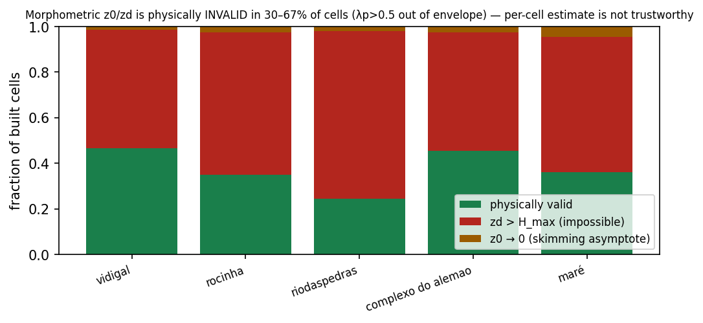

*Figure 6.6 — per site, the fraction of built cells where the morphometric z0/zd is
physically valid (green) vs impossible (zd > H_max, red; z0 → 0, brown).*

> **Headline caveat (expert-council review, 2026-06-19).** The per-cell morphometric
> z0/zd is **physically invalid in 53–75 % of built cells**: the displacement height
> exceeds **H_max** (above the tallest building — impossible) or z0 collapses toward 0
> (the skimming asymptote — "smoother than grass"). λp > 0.5 and λf ≈ 1 (dissolved,
> deep in the skimming-flow regime) sit well past every method's calibration array, so
> the drag formula saturates and z0 is set by σH/H_max, not the fabric. **This is model extrapolation,
> not measurement.** The per-cell z0 map is illustrative only; the **method-spread
> envelope** (the four methods diverge ~20×, ≈1.5 orders) is the reportable result, and
> any absolute z0 is **CFD-gated** (validated/recalibrated by the step-R-C drag-centroid
> extraction, pending OpenFOAM). A second hard limit: morphometric z0(θ) is
> **180°-symmetric by construction** (frontal area is identical for opposite winds), so
> it can never represent channelling or N-vs-S asymmetry — only the CFD can. Per-cell
> `flag_zd_gt_Hmax` / `flag_z0_collapsed` / `roughness_physically_valid` mark this.

The aerodynamic roughness length **z0** and zero-plane displacement **zd** are
the boundary condition the CFD inlet sees. They are estimated **morphometrically**
— per 10 m cell and per wind sector — from the §4 grid (λp, λf in 8 directions,
H_mean, σH) plus per-cell H_max derived from the building heights, using the
vendored UMEP roughness calculator (Kent & Grimmond: Macdonald 1998, Raupach 1994,
Millward-Hopkins 2011, Kanda 2013). z0/zd were recomputed on the corrected
**dissolved (party-wall-corrected) λf** (§4.2), and the invalidity conclusion is
unchanged — the per-cell physically-valid fraction is now 0.47 (Vidigal), 0.35
(Rocinha), 0.46 (Complexo do Alemão), 0.36 (Maré), 0.25 (Rio das Pedras), i.e. ~53–75 %
invalid still — because the invalidity is driven by zd > H_max and density, not by the
λf magnitude. Kanda is primary because it is height-
variability-aware; Macdonald is carried as the σH-blind baseline. The directional
λf gives a roughness rose z0(θ) — favela packing is anisotropic, so a single mean
would discard real directional structure.

**The two roles of z0 are decoupled.** The morphometric z0(θ)/zd(θ) of the
*upstream settlement* sets the CFD **inlet ABL profile and the k_eq target**; the
**ground z0 inside the resolved patch stays small and mesh-valid**, because the
explicitly-meshed buildings already supply the form drag. This removes the
Blocken et al. (2007) sand-grain wall-function inconsistency and replaces a
guessed inlet roughness with a morphometrically-derived **prior** — out-of-envelope,
flagged, and to be recalibrated by the CFD-extracted z0 of step R-C. Per-patch
morphometric z0(θ) is
written to `outputs/{site}/sampling_cfd/campaign_sampling/patch_roughness.csv`
(119 patches) as the CFD-inlet hand-off.

**Findings, with honest caveats.** Three features of favela fabric place it
outside the calibration envelope of every published method (all fit on cube/
obstacle arrays at λp ≈ 0.05–0.5):

- **zd > H_max in 53–75 % of cells — physically impossible** (displacement above the
  tallest building; the saturation flagged above). The milder zd > H_mean (70–93 %) is
  expected for heterogeneous canopies (Kanda/Kent); the zd > H_max fraction is the
  out-of-envelope failure, not a feature.
- **λp > 0.5 in 56–88 % of cells** (77 of 119 CFD patches) — most fabric is an
  extrapolation, not an in-envelope estimate; flagged per cell/patch
  (`flag_pai_over_envelope`), never silently.
- **The four methods diverge by up to ~20× in the dense regime** — and the naive
  expectation that the σH-aware methods simply lift z0 above Macdonald does *not*
  hold: in the skimming limit Kanda can fall *below* Macdonald (Maré, Rio das
  Pedras). The disagreement is the morphometric uncertainty, and resolving it
  requires anchoring against CFD.

No published z0/zd estimate exists for any favela or informal settlement; the
height-randomness (which raises roughness) versus extreme-λp skimming (which lowers
it) tension is unresolved in the literature. The campaign CFD, processed via the
Jackson (1981) drag-centroid + log-law fit above the canopy, is the instrument to
settle it — pending the OpenFOAM run (the CFD-extracted z0 of step R-C, vs the
morphometric z0 here). Method equations, coefficients, and the full reference list
are in `docs/roughness_plan.md`; per-step decisions in `docs/roughness_decisions.md`.

---

## 7. CFD Integration Pipeline

### 7.1 Overview

The code to ingest CFD results, aggregate them onto the 10 m
morphometric grid, and combine directional simulations into an
annualised ensemble is implemented in `src/cfd_integration/`
(~1,100 lines across five modules: `schema.py`, `io.py`, `aggregate.py`,
`metrics.py`, `weighting.py`) and covered by **71 passing unit tests**.

**Input contract** (documented fully in
`src/cfd_integration/README.md`, provided to the CFD agent as the
delivery specification):

```
data/{site}/cfd_results/{patch_id}/{wind_direction}/
  sample_points.csv       # required — 15k rows at z = 1.5 m, 2 m spacing
  summary.json            # required — simulation metadata
  field.vtu               # optional — full 3D field
```

Plus `data/{site}/wind_rose.json` per site (now built from measured
INMET BDMEP / Iowa ASOS records; see §2.3 and Figure S5).

### 7.2 Module architecture

- **`schema.py`** — dataclasses for sample points, per-simulation
  metadata, campaign aggregates, wind roses; defines the 8 cardinal
  directions and runtime validators.
- **`io.py`** — CSV + JSON loading (primary path), optional VTU loading
  via `pyvista` (fallback), directory traversal for per-site campaigns.
- **`aggregate.py`** — spatial aggregation onto the morphometric grid.
  Primary function `aggregate_to_grid()` maps CFD samples onto individual
  10 m cells whose centroid falls inside the 100 m-diameter circular
  analysis patch (the scientifically defensible zone per Tominaga 2008 /
  Blocken 2015). `aggregate_to_domain()` is a supplementary function
  that includes the rest of the rectangular domain (out to the
  per-direction blockMesh boundary) for robustness checks.
- **`metrics.py`** — health-relevant scalar quantities:
  - `velocity_magnitude()` — √(U² + V² + W²)
  - `stagnation_fraction()` — fraction of samples with |U| < threshold
    (default 0.5 m/s, the commonly cited calm-air limit)
  - `turbulent_intensity()` — TI = √(2/3 · TKE) / U_ref
  - `ach()` — air change rate using the standard urban-climate
    formulation ACH = 3600 × ⟨|U|⟩ / L
  - `low_wind_percentile()` — worst-case stagnation (default p10)
  - `canyon_ventilation_efficiency()` — ⟨|U|⟩ / U_ref
- **`weighting.py`** — wind-rose-weighted combination of 8 directional
  simulations into an annualised metric. Supports three weighting modes:
  uniform (1/8 each), frequency-only (∝ f_dir), and frequency × speed
  (∝ f_dir · U_dir, which emphasises directions contributing more wind
  energy). `worst_case_direction()` finds the direction maximising any
  chosen metric (e.g. the direction producing most stagnant flow).

### 7.3 CFD agent specification

The full delivery contract (CSV schema, JSON schema, directory layout,
methodology requirements for turbulence model, boundary conditions,
meshing, post-processing, and convergence targets) is documented in
**`src/cfd_integration/README.md`**. Key decisions baked into the
contract:

- **Simulation domain:** rectangular per-direction (one `blockMesh`
  per patch × wind-direction). Per-patch extents `5/15/5/5 · H_max + R`
  with `lateral = max(5·H+R, 5·W) = 500 m` for our 100 m patches.
  Top = `5 · H_max`. See `rectangular_domain_v1.json` for the full rule
  set. Pedestrian sampling only valid within the central 100 m-
  diameter circular analysis patch.
- **Turbulence model:** k-ω SST (standard RANS for ABL flows at this
  scale).
- **Inlet:** logarithmic velocity profile, suburban roughness class
  (z₀ ≈ 0.03 m), turbulence intensity ≈ 0.15 at 10 m.
- **Simulations per site:** 8 cardinal directions, sharing one mesh
  with rotated inlet BC. 119 patches × 8 directions = 952 total
  simulations for the full campaign.
- **Sampling:** horizontal slice at z = 1.5 m, 2 m in-plane spacing,
  OpenFOAM `sample` utility, delivered as CSV.
- **Recommended validation patch:** **MAR-P07** (Maré, flat, 12.2 m
  max height, 1,200 buildings in domain) — the simplest end-to-end
  test case to validate the full pipeline before scaling.

### 7.4 End-to-end usage (post-CFD)

```python
from src.cfd_integration import (
    load_campaign_results, aggregate_to_grid, weighted_by_wind_rose,
)

campaign = load_campaign_results("vidigal")  # reads data/vidigal/cfd_results/
for patch_id in campaign.patch_ids():
    per_direction = {
        dir_: aggregate_to_patch(campaign.patches[patch_id][dir_],
                                 patch_center_xy)
        for dir_ in campaign.directions_for(patch_id)
    }
    annual = weighted_by_wind_rose(per_direction, campaign.wind_rose,
                                   weight_by="freq_speed")
    # annual = {annual_U_mean, annual_stagnation_frac, annual_ach, ...}
```

`scripts/analyze_cfd_results.py` runs the four-step chain
(annualise per patch → annualise per cell → predictor OLS →
fig 5 wind panel) and writes `predictor_regression.csv`. Predictors
are SVF, λp, slope, σ_H, and three terrain-aspect covariates:
`aspect_sin`, `aspect_cos` (the orthogonal pair for the circular
aspect, computed per patch as the circular mean of `aspect_deg`
over the 100 m analysis disk), and `aspect_wind_alignment` =
cos(aspect − dominant-wind-direction). The dominant wind direction
is the frequency-weighted circular mean of the per-site wind rose.
On the synthetic dataset that exercises this chain end-to-end the
aspect coefficients are at noise level (the synthetic generator
does not encode aspect into U_mag); they will become non-trivial
once real CFD returns the directional flow field.

### 7.5 Manuscript figure series (synthetic-CFD preview)

A separate figure track at `docs/manuscript/figures/` produces the
journal-manuscript artefacts. These consume real morphometrics +
solar but currently inject **synthetic CFD** through the same
`src.cfd_integration` API the real campaign will use, so each plot
will refresh with a one-line config swap when real numbers land.
Three figures are wired below; the rest of the manuscript series is
upstream of CFD (Figs 0.1–0.2) and unaffected by the synthetic flag.

**Fig 0.3 — Environmental performance.** Per-patch wind / sun maps
for four representative morphologies (hillside-open, hillside-dense,
flatland-open, flatland-dense) plus pooled ACH and sun-hours
distributions across the campaign. Each patch is a 100 m analysis
disk overlaid on the SVF raster, with U_mean colour-coded against
Lawson 1.0 m/s pedestrian stagnation. After typology re-classification
of Complexo do Alemão as **mixed** (rather than hillside), the
hillside-open patch shifted from CDA-P22 to VDG-P17 (SVF=0.57,
λp=0.20).

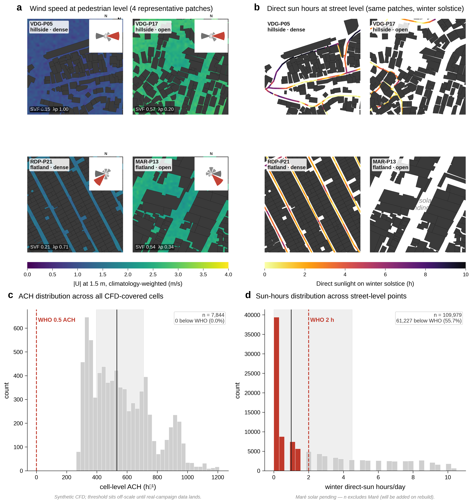

**Figure 0.3.** Cross-site environmental performance: representative
patch maps + pooled distributions across all five sites (Maré's
street-solar gpkg landed in the 2026-06 re-baseline).

**Fig 0.4 ★ — Diagnostic taxonomy at favela scale (headline).** Four-
state per-10 m-cell classification: **Adequate** (vent + sun both
pass), **Ventilation constraint** (U_mean < 1.0 m/s), **Sunlight
constraint** (winter direct sun < 2 h), **Compound constraint**
(both). Okabe-Ito colour-blind-safe palette locked at
`#BDBDBD`/`#0072B2`/`#E69F00`/`#D55E00`. Layout: five site maps (equal-
width panels with per-site scale bars at 100/200/500 m), a 2-D
performance scatter with a twin top-axis carrying indoor-equivalent
ACH via the canyon→room coupling α=1/150 (Etheridge-Sandberg), and
horizontal stacked bars for hillside / mixed / flatland aggregates.

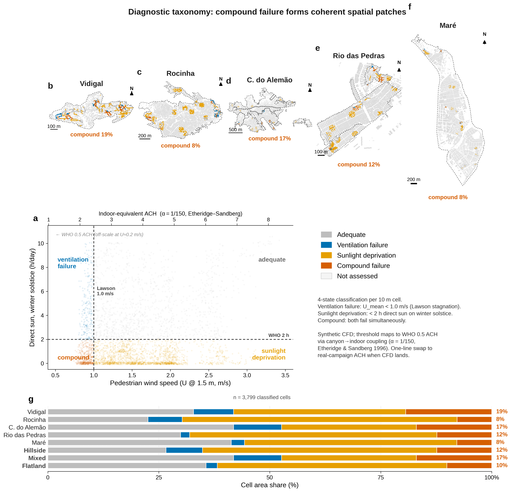

**Figure 0.4. ★ HEADLINE.** Four-state diagnostic taxonomy at favela
scale. Bottom axis on the scatter is operational outdoor U_mean
(Lawson 1.0); top axis is indoor-equivalent ACH (α=1/150). WHO
0.5 ACH lies off-scale at U≈0.21 m/s and is shown as an annotated
callout.

**Fig 0.5 — Predictors and typology contrast.** Four panels: (A)
RF permutation importance, vent vs sun side-by-side; (B) partial-
dependence curves for the three top predictors (SVF, λf, slope) on
both targets with 95 % bootstrap CI; (C) logistic forest plot
(main effects + three interactions), filled markers p<0.05, hollow
n.s., cluster-robust SE on site; (D) SVF→U_mean changepoint
regression with bootstrap CI and a twin right axis carrying indoor-
equivalent ACH. On the synthetic dataset SVF dominates both
targets (5-fold AUC vent=0.70, sun=0.86), with the changepoint
landing at SVF=0.12 [CI 0.12, 0.50] — the wide CI is expected
because the synthetic U_mean is roughly linear in SVF by construction.

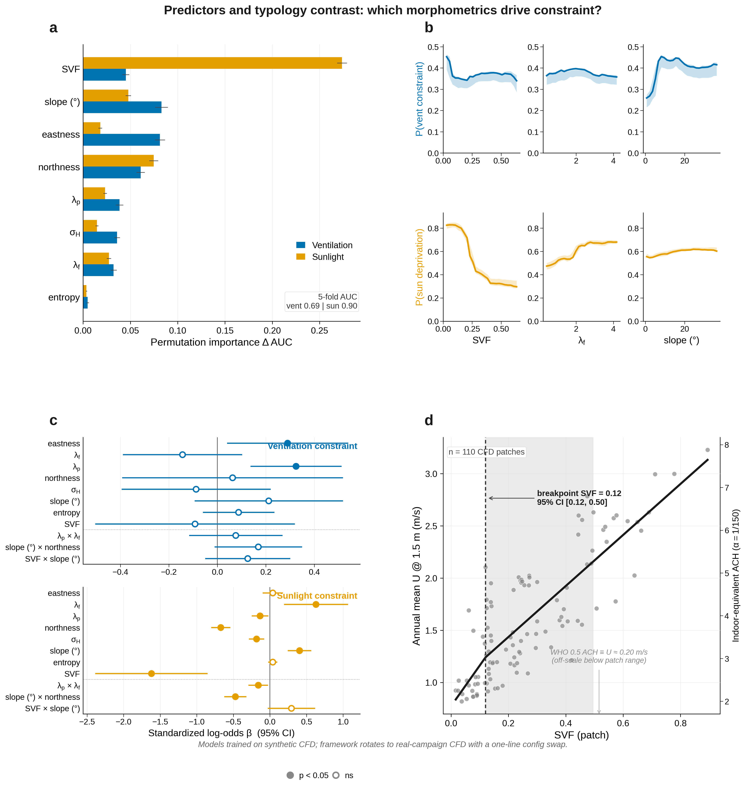

**Figure 0.5.** Statistical predictors and typology contrast. Pipeline
artefacts at `outputs/comparative/diagnostic_models/` (rf_importance.csv,
pdp_curves.csv, logit_coefs.csv, changepoint_svf_ach.csv) are
regenerated by `scripts/run_diagnostic_models.py`. Once real CFD
lands, the SVF→U_mean changepoint is expected to tighten and the
forest-plot effect sizes for ventilation predictors will increase.

**Fig 0.6 — Climate-stress robustness.** A wind-stilling stress test
that scales the U field uniformly by {1.00, 0.85, 0.70} to mimic the
IPCC AR6 mid-century projection for SE Brazil, then re-runs the 0.4
four-state classifier on each scaled snapshot. Three panels: (A)
stacked bars of state shares per site per scaling level (compound-
constraint rate climbs monotonically — Vidigal 19 → 23 → 30 %, Rocinha
58 → 65 → 70 %, CDA 17 → 21 → 26 %, RdP 13 → 16 → 19 %); (B) per-cell
transition maps at U×0.85 highlighting only the cells that *flip* into
ventilation- or compound-constraint — Rocinha is the largest absorber
(10.2 % of cells flip to compound constraint) while Vidigal and CDA each shed
~3.6 %; (C) typology vulnerability ladder — hillside 7.6 %, flatland
5.5 %, mixed 3.6 %. Thermal coupling is not modelled — only the
ventilation half of the diagnosis moves.

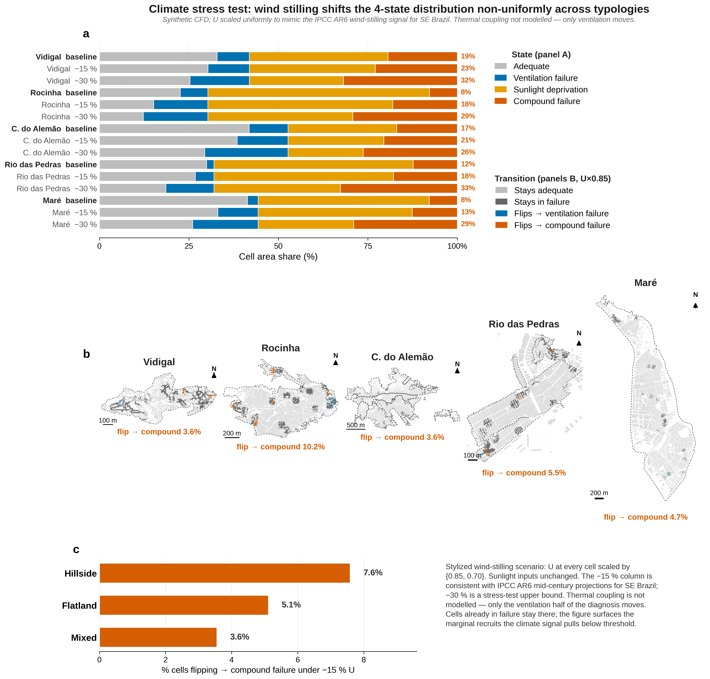

**Figure 0.6.** Climate-stress robustness: wind-stilling shifts the
4-state distribution non-uniformly across typologies, now including
flatland Maré in panel B.

**Fig 0.7 — Spatial clustering of compound constraint (proposition).**
Empirical follow-up to 0.4: the compound-constraint pixels are *not*
randomly distributed — they form coherent corridors. Three panels:
(A) Global Moran's I on the binary compound-constraint indicator under
Rook contiguity (all five sites: Vidigal I=0.64, Rocinha I=0.59, CDA
I=0.80, RdP I=0.80, Maré I=0.77; all p<0.001 vs 999-permutation
random-label null); (B) LISA cluster maps showing the contiguous
compound-constraint components per site (per-site compound-corridor
shares shown in the panel); (C) cluster-size CCDF pooled
across sites — observed (orange) vs random null (grey dashed). The
heavy upper tail in the observed CCDF (single components extending
past ~30 cells) is the signature of spatial clustering: a planner
intervening on a single cell affects a much larger neighbourhood
than a random-pixel diagnostic would suggest.

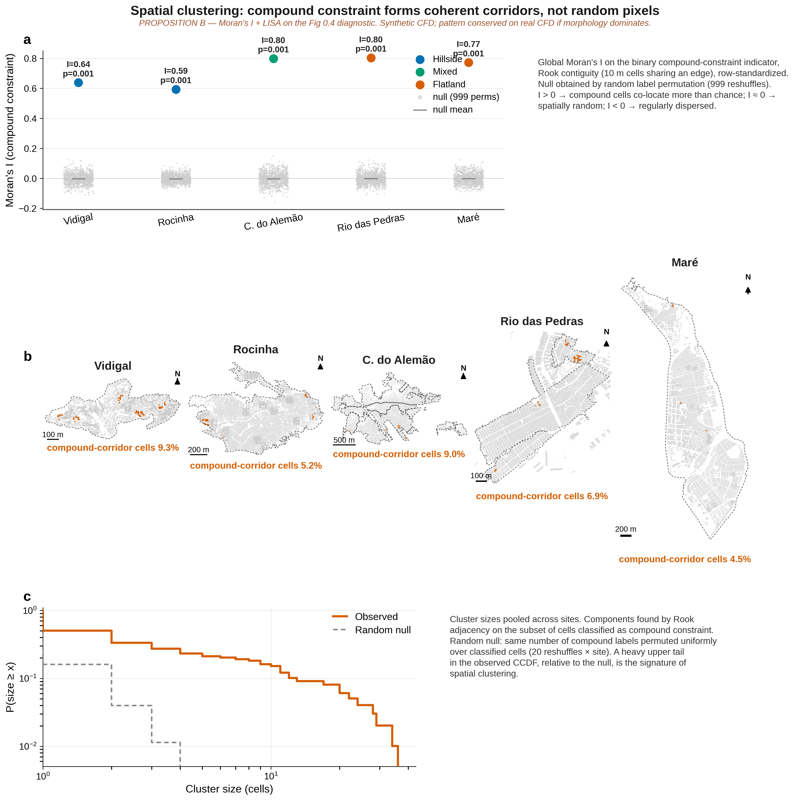

**Figure 0.7. PROPOSITION.** Compound-constraint corridors are
empirically clustered, not randomly distributed. Synthetic CFD;
the spatial-statistics conclusion is conserved over the U-field
modelling choice (Moran's I uses only the binary classification
output). Pipeline: `scripts/run_diagnostic_models.py` produces
the per-cell 4-state label; the figure script
(`docs/manuscript/figures/fig_0_7_proposition_clustering.py`) runs
the libpysal/esda statistics on it.

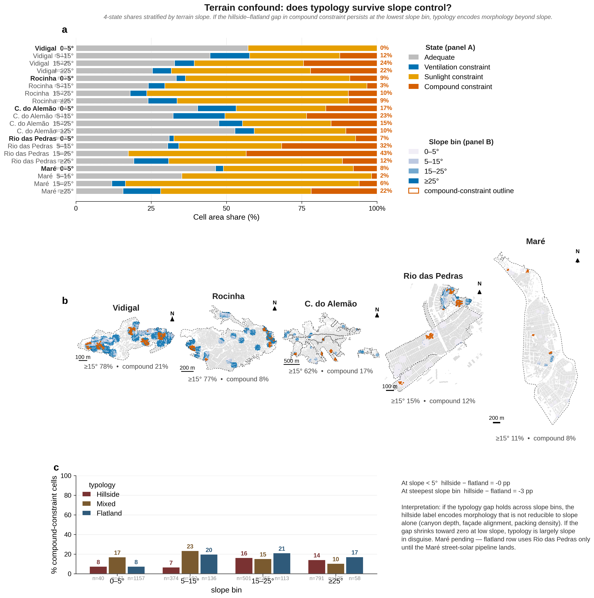

**Figure 0.8.** Terrain confound test for the headline typology
finding. Panel (a) stratifies the 4-state diagnostic by slope bin
(0–5°, 5–15°, 15–25°, ≥ 25°) per site; compound-constraint share rises
monotonically with slope on Vidigal (0 % → 22 %) and Rocinha
(3 % → 9 %). Panel (b) maps each site coloured by slope bin with
compound-constraint cells outlined in red — the outlines concentrate on
the steeper (darker blue) cells in hillside sites. Panel (c) is the
proposition: % compound-constraint cells per typology, *stratified by
slope bin*. **At slope < 5° the hillside − flatland gap is −2 pp; at
the steepest slope bin it is +2 pp.** When slope is controlled the
typology label nearly stops doing work, which means most of the
"hillside is more compound-constraint-prone" signal in Fig 0.4 and the
typology ladder in Fig 0.6 is *slope acting through the typology
label*, not a residual morphology effect. The honest reading: slope
is a stronger predictor than typology categoricals once both are
available. The n in each bin is shown — the flatland steep-bin
(n = 26) and hillside flat-bin (n = 40) are small, so the proposition
is the rough magnitude (gap close to zero at controlled slope), not
the sign of an individual pp value. Maré is excluded until its
street-solar pipeline lands; the flatland row in panel (c) is Rio das
Pedras only. Synthetic CFD; the slope-stratification operates on the
4-state label so the same panel re-renders unchanged once real CFD
arrives. Pipeline:
`docs/manuscript/figures/fig_0_8_terrain_confound.py` reads
`outputs/{site}/cfd_analysis/grid_with_cfd.gpkg`, aggregates
street-solar into 10 m cells, merges `slope_deg` from
`grid_metrics.gpkg`, and produces the panel set.

---

## 8. Repository Structure

Canonical output layout (as of 2026-04-13):

```
outputs/
├── {site}/
│   ├── morphometrics/         # SVF, per-building metrics, 10m grid,
│   │   ├── svf/              #   figures, report
│   │   ├── buildings/
│   │   ├── grid/
│   │   ├── figures/
│   │   └── report/
│   ├── morphometrics_20m/    # 20m grid (for resolution sensitivity)
│   └── sampling_cfd/
│       ├── pilot_sampling/   # 12–15 patches
│       └── campaign_sampling/ # 22–25 patches (pilot + new)
│
├── comparative/               # cross-site analysis
│   ├── pilot_summary/        # pilot-phase cross-site comparison
│   ├── final_allocation/     # 119-patch campaign summary
│   └── audits/               # topology audits
│
└── paper_figures/             # manuscript figures
    ├── fig_style.py          # shared style module
    ├── fig01_study_sites.py
    ├── fig02_morphometric_distributions.py
    ├── fig03_svf_lambda_coupling.py
    ├── fig04_sampling_design.py
    ├── fig05_morphometric_maps.py
    ├── figS1_correlation_matrices.py
    ├── figS2_context_extension.py
    ├── figS3_resolution_sensitivity.py
    ├── figS4_patch_thumbnails.py    # outputs not currently published in the TR
    ├── figS5_wind_roses.py
    ├── README.md
    └── exports/              # rendered PNG + SVG
```

Source modules:

```
src/
├── config.py                  # paths, CRS, filtering thresholds
├── cartography.py             # scale bars, north arrows, UTM formatting
├── morphometry/               # grid computation
│   ├── grid.py
│   ├── indicators.py
│   ├── audit.py
│   ├── figures.py
│   └── report.py
├── svf_v2/                    # SVF engine (Tregenza-145 ray-cast)
│   ├── compute.py            # per-point and parallel raycast drivers
│   ├── scene.py              # 3D scene from DTM + footprints
│   ├── sampling.py           # passageway / street-centreline samplers
│   ├── paths.py              # per-site path registry
│   ├── io.py                 # per-cell aggregation + raster I/O
│   ├── utils.py
│   ├── facades.py            # façade-side sampling
│   └── visualize.py
├── solar/                     # solar access (phase 4)
└── cfd_integration/           # CFD ingestion (phase 7)
    ├── schema.py
    ├── io.py
    ├── aggregate.py
    ├── metrics.py
    ├── weighting.py
    └── README.md             # CFD agent specification
```

Key scripts:

| Script | Purpose |
|--------|---------|
| `run_morphometric_audit.py` | Per-site morphometric grid + SVF audit + report |
| `build_extended_context.py` | Site + city-wide building and DTM merger |
| `run_pilot_sampling.py` | 12-strata pilot batch (12–15 patches per site) |
| `run_campaign_sampling.py` | Campaign allocation (SVF-priority, target-total) |
| `build_wind_rose.py` | INMET → wind_rose.json ingestion |

---

## 9. Validation Summary

| Check | Status | Evidence |
|-------|--------|----------|
| Building geometry validity | PASS (10 repaired, all sites clean) | `outputs/comparative/audits/rocinha_topology_audit.md` |
| CRS consistency | PASS | all inputs verified EPSG:31983 on load |
| SVF passageway aggregation (no centroid artefacts) | PASS | diagnostic in `src/morphometry/grid.py::_aggregate_svf_to_grid` |
| DTM sentinel value handling | PASS (post-fix) | sentinel = −9999 pixels masked in extended-context merge per `scripts/build_extended_context.py` |
| Extended context eligibility recovery | PASS | Vidigal eligible cells go from ~0.45 to 0.80 of grid with the 300 m extension; see `outputs/comparative/pilot_summary/candidate_pool_comparison.csv` |
| Rectangular-domain v1 eligibility (all 119 patches) | PASS | `eligible = true` in every row of `outputs/comparative/cfd_methodology/audit_v1.csv`; uniform 2 % silhouette blockage (well under 5 % AIJ); source-data envelope 565–646 m covered by `buildings_extended_700m.gpkg` on all 5 sites |
| Minimum inter-patch spacing (80 m) | PASS | realised minimum: 80–85 m across sites |
| Resolution sensitivity (10 m justified) | PASS | Figure S3; 10 m captures features 20 m loses |
| 12-strata coverage (≥ 1 site per stratum) | PASS | all 12 strata non-empty when pooled |
| CFD integration unit tests | PASS | 71 / 71 tests |

---

## 10. Known Limitations

### 10.1 Neutral stability is assumed

All five `wind_rose.json` files
   now carry measured hourly observations (`quality_flag: "measured"`,
   2015–2024 window, n = 64,088–89,439; see §2.3). The methodological
   simplification that remains is the assumption of neutral atmospheric
   stability across all directions and seasons. Stability classes are
   not separated; CFD inflow uses the neutral log-law profile. In
   practice this is conservative for the dispersion-relevant low-wind
   regimes that dominate Rio das Pedras and Complexo do Alemão (calm
   fractions 46 % and 33 %), and a known limitation for the more
   stably stratified nocturnal hours.

### 10.2 CFD results not yet integrated

`src/cfd_integration/` is
tested but has not yet processed real simulation data. Any
assumptions about sample-point density, column naming quirks, or
edge cases in OpenFOAM output will only surface at first ingestion.
The first pilot patch (VDG-P07) is in flight; running the test
suite plus the `cfd-results-ingestor` validation against the returned
results will catch most issues.

### 10.3 SVF cross-validation against UMEP

(Limitation closed
2026-04-29 for Vidigal; height-matched at z = 1.5 m for Vidigal and
Maré 2026-04-30; extended to all 5 sites 2026-05-01.) The
   Tregenza 145-patch engine was cross-validated against UMEP's
   shadow-casting SVF (`svfForProcessing153`) at z = 1.5 m after
   lowering building heights by 1.5 m to height-match the two engines:

   | Site | n | r² | slope | RMSE | bias |
   |---|---:|---:|---:|---:|---:|
   | Vidigal | 2,510 | 0.68 | 0.96 | 0.12 | +0.01 |
   | Rocinha | 5,646 | 0.81 | 1.01 | 0.14 | +0.09 |
   | Rio das Pedras | 1,503 | 0.93 | 1.25 | 0.11 | +0.08 |
   | Complexo do Alemão | 4,838 | 0.76 | 0.92 | 0.17 | +0.14 |
   | Maré | 9,516 | 0.94 | 0.97 | 0.12 | +0.09 |

   Four of five sites agree at slope within ±8 % of unity (Vidigal,
   Rocinha, Complexo do Alemão, Maré). Rio das Pedras at slope = 1.25
   reflects its small valid grid (n = 1,503) concentrated in the
   0.3–0.5 SVF band where the 153-patch shadow-cast and 145-patch
   ray-cast integrations diverge most. Both engines are defensible
   operational definitions of SVF; the 5-site slope-≈-1 cluster
   establishes that the MorphoFavela Tregenza-145 ray-cast engine is consistent
   with an independent benchmark across the full morphological range
   represented in the campaign. See §4 cross-validation table for
   per-site interpretation and
   `outputs/{site}/morphometrics/svf/umep_validation/scatter.png`
   (S6 Vidigal, S7 Maré, S8 Rocinha, S9 Rio das Pedras,
   S10 Complexo do Alemão) for per-cell scatters.

### 10.4 Resolution sensitivity is 10 m vs 20 m only

Finer grids
(5 m, 2 m) would be prohibitively expensive at site scale but
warrant a spot-check for the CFD patches specifically. Not a
priority for the current milestone.

### 10.5 Cidade de Deus excluded

A data integrity issue in the CDD
building footprints (geometry inconsistencies; see project memory
`project_cdd_data_bug`) leaves CDD outside the 5-site campaign.
This is a final decision for the current campaign cycle: the
119-patch allocation, OpenFOAM submission, and downstream analysis
all assume 5 sites. Re-onboarding CDD is out of scope until the
building data is reprocessed upstream of this repository.

### 10.6 Direct ground-solar measurements (closed 2026-05-08)

Originally a Vidigal-only limitation. Closed 2026-05-08:
`scripts/run_street_solar.py` produces a four-date seasonal envelope
(winter and summer solstices, two equinoxes, 30-min sampling) and was
extended to all five campaign sites in commits `0a847f6` (refactor),
`3a71349` (RdP), `0a5f3ca` (Rocinha), `f43355e` (CDA), and the matching
Maré commit. Each site's
`outputs/{site}/morphometrics/svf/svf_streets_solar.gpkg` carries
`solar_hours_winter / summer / equinox_mar / equinox_sep / annual` plus
matched irradiance columns; §5.4 (cross-site table + Figure 8)
consumes them. The legacy `scripts/compute_solar_access.py` remains in
the repo but is superseded — its single-date 60-min output was
replaced by the seasonal runner on 2026-05-07.

### 10.7 Per-cell aerodynamic roughness is invalid at favela density

The morphometric z0/zd of §6.6 is **physically invalid in 53–75 % of built cells**:
favela λp > 0.5 and λf ≈ 1 (dissolved) sit well past the calibration
arrays of every method (Lettau, Macdonald, Raupach, Millward-Hopkins, Kanda), so the
drag-partition formula saturates and returns impossible values — displacement above
the tallest building (zd > H_max) or z0 → 0 ("smoother than grass"). The per-cell z0
field is therefore *illustrative only*; the reportable quantity is the four-method
spread *envelope* (~20×, ≈1.5 orders of magnitude), and any absolute roughness is
**CFD-gated** — to be validated/recalibrated by the step-R-C drag-centroid extraction
once OpenFOAM returns. A second structural limit: morphometric z0(θ) is
180°-symmetric by construction (frontal area is identical for opposite winds), so it
cannot represent channelling or N-vs-S asymmetry; only the CFD can. Per-cell flags
(`flag_zd_gt_Hmax`, `flag_z0_collapsed`, `roughness_physically_valid`) mark this.

### 10.8 The morphological typology has known limits

(§5.5) k = 6 morphotypes is a domain-driven granularity, not a distance-based optimum
(internal indices favour k = 2–3; Calinski-Harabasz does peak at k = 6); it is
justified by leave-one-site-out reproducibility (ARI 0.763). Two morphotypes (T1, T5)
are flatland-conditional rather than universal. The held-out experience validation leans on winter-sun/WHO-failure
(ray-cast, semi-independent) because SVF is partly geometric (SVF ≈ f(λp, H/W)).
Experience profiles are read on the ~35 % of cells with a street observer. The
typology→failure *predictor* (§5.5 forward look) is a separate, forthcoming sub-study.

### 10.9 Sensitivity to grid resolution (MAUP)

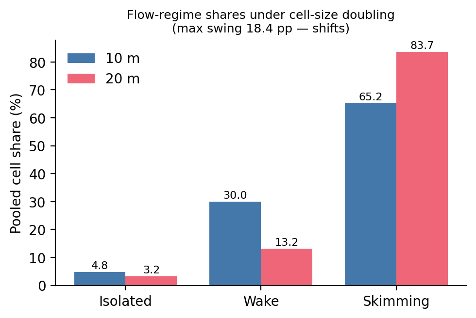

The Modifiable Areal Unit Problem is the standard objection to grid-based
morphometrics. A direct A/B (`scripts/run_maup_sensitivity.py`,
`outputs/comparative/maup/maup_sensitivity.json`) re-derives the pooled Oke /
Grimmond-Oke flow-regime shares on built cells (`building_count > 0`) at the
production 10 m grid and at a doubled 20 m grid, holding the regime thresholds
fixed (λf < 0.15 isolated, ≥ 0.65 skimming). **Both resolutions are placed on
the same dissolved (party-wall-corrected) λf basis** — an earlier draft of this
appendix compared the dissolved 10 m grid against a 20 m grid still carrying the
pre-dissolve *summed* λf, which inflated the coarse grid by the over-count factor
(2.7–4.4×) and produced a spurious *rise* in skimming; that comparison is
superseded. On a like-for-like dissolved basis the shares are **not** invariant
to cell size, and the genuine effect runs the other way: skimming **falls** from
65.2 % to 31.1 % (**−34.1 pp**) while wake rises from 30.0 % to 58.8 %
(**+28.8 pp**) and isolated edges up from 4.8 % to 10.1 % (**+5.3 pp**); the
pooled λf median drops from 0.831 to 0.493 (**−40.7 %**) even as σH rises
+15.6 %. This is the expected geometric scaling — λf is a frontal-over-plan ratio,
and doubling the cell width grows the dissolved frontal area roughly linearly
while the plan-area denominator grows quadratically, so λf nearly halves and
cells migrate *out* of the skimming band into wake. It is reported as measured
rather than smoothed into a "stable" verdict. The operational consequence is
narrow: the *absolute* regime-share figures are strongly resolution-dependent and
must always be quoted at the locked 10 m resolution (the figures in §5.2 and
`lambda_f_canonical.json`), which this A/B reproduces exactly; the cross-site
*ordering* of morphologies is preserved (max per-site swing 25–39 pp, same
direction everywhere). The complementary distribution-shape analysis at §4.6
(Figure S3) shows the 10 m grid additionally resolves multimodality that 20 m
aggregation erases, which is the basis for fixing 10 m as the production grid.

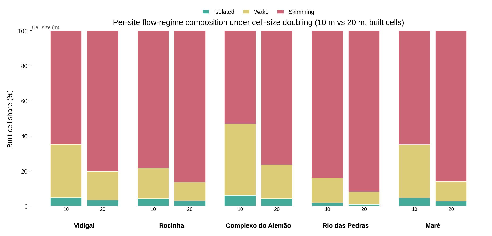

---

## 11. Next Steps

**In this repository:**

- [x] Wind ingestion — measured roses for all 5 sites
      (completed 2026-04-27, see §2.3)
- [x] Build the result-side analysis pipeline
      (`scripts/analyze_cfd_results.py`) end-to-end on synthetic CFD
      data so the chain is exercised before VDG-P07 returns
      (completed 2026-04-29; smoke-tested across all 5 sites
      2026-04-30: 359–405 covered cells per site, predictor signs
      consistent with morphology). Producer↔validator loop closed
      via `cfd-results-ingestor` against the synthetic outputs;
      both surfaced WARNs fixed in `scripts/generate_synthetic_cfd_results.py`
      so future synthetic runs hit PASS.
- [x] Cross-validate SVF against UMEP shadow-cast reference at
      pedestrian height across all 5 sites (closed 2026-05-01;
      slopes 0.92–1.25 with four of five within ±8 % of unity;
      see §10.3 and §4).
- [x] Migrate the campaign domain methodology from cylindrical
      (radius 250 m) to rectangular per-direction (Franke / COST 732
      / Blocken 2015 wide-obstacle scheme); audit all 119 patches
      against the new rule set; extend `buildings_extended_*` and
      `dtm_extended_*` from 300 m to 700 m on all five sites; drop
      the deprecated `blocken_radius_required` indicator column;
      publish `src/cfd_integration/rectangular_domain_v1.json` as
      the canonical contract (closed 2026-05-08, see §6.5; 119/119
      eligible after the buffer extension, no patches dropped).
- [ ] Optional: 20 m grids already exist; generate the variant Fig S3
      forms (`--variants` flag) if reviewers request the scatter or
      difference-map views
- [ ] Draft the Nature Cities manuscript (separate from this technical
      report) once the result-side pipeline is operational

**In the CFD repository:**

- [ ] Implement OpenFOAM case from per-patch exports (template in
      `outputs/{site}/sampling_cfd/campaign_sampling/patches/{id}/`)
      using the v1 rectangular domain rule set
- [x] ~~Validate pipeline on VDG-P07~~ — VDG-P07 cylindrical pilot
      killed 2026-05-08 in favour of selecting fresh pilots from the
      v1 rectangular campaign (see §6.5); pilot picks deferred to the
      Airflow side
- [ ] Mesh convergence study (one v1 pilot per morphology stratum)
- [ ] Run full 952-simulation campaign
- [ ] Post-process to `sample_points.csv` + `summary.json` per
      simulation

**After CFD results land here.** All of the machinery for these
steps was built and synthetic-validated in commits `c9d25d6`
(pipeline) and `0851b5e` (synthetic-generator self-validation);
each box flips when the same code path is re-run against real
Airflow output.

- [ ] Verify first patch ingests correctly via `cfd-results-ingestor`
      (validator already accepts both MorphoFavela-native CSV and Airflow-
      native parquet layouts; tested against synthetic 160/160 cleanly)
- [ ] Annualise via wind-rose weighting (`src.cfd_integration.weighting`)
      — implemented; default weight is `freq_speed`
- [ ] Map CFD metrics onto the 10 m grid (nearest-patch v0) —
      implemented; covered cells 359–405 per site under synthetic
- [ ] Extend Figure 5 to include wind-velocity panel
      (`outputs/{site}/cfd_analysis/figures/fig5_wind_panel.png`
      generated under synthetic; awaits real numbers for the report)
- [ ] Statistical analysis: SVF/λp/terrain as predictors of ACH and
      stagnation — predictor regression CSV generated per-site under
      synthetic with expected sign structure
- [ ] Health-outcome linkage

---

## 12. Reproducibility

Every numerical claim, table, and figure in this report can be
regenerated from the committed scripts. This section is the index.

### 12.1 Environment

```bash
git clone https://github.com/thrmnn/MorphoFavela.git && cd MorphoFavela
conda create -n morphofavela python=3.11 && conda activate morphofavela
pip install -e ".[dev]"          # ([gpu] extra exists but the GPU SVF backend is not yet ported to v2 — CPU ray-casting is the supported backend)
```

GDAL / GEOS native libraries must be present (`apt install libgdal-dev`
on Linux, `brew install gdal` on macOS) before `pip install`.

### 12.2 Smoke test (≤ 2 min on a fresh clone)

```bash
python -m pytest tests/ -m "not integration" -q --tb=short
# → 663 tests pass; 69 integration tests deselected
# (full suite: 710 pass + 22 skip + integration; use `python -m pytest`
#  to bypass any older user-site `pytest` on PATH)
```

If this passes, the codebase is loaded correctly. If GDAL or pyvista
fail to import, see [`docs/onboarding/local_setup.md`](../onboarding/local_setup.md).

### 12.3 Per-site pipeline

Substitute any of `vidigal | rocinha | riodaspedras | complexo_do_alemao | maré`
for `<site>`. Inputs must be in place under `data/<site>/` per
[`data/README.md`](../../data/README.md).

```bash
# Stage 1: extended building + DTM context — buffer must cover the
# v1 rectangular CFD source-data envelope (max 646 m). Use 700 m.
python scripts/build_extended_context.py --area <site> --buffer 700

# Stage 2: morphometric grid + SVF audit + per-site report
python scripts/run_morphometric_audit.py --area <site>
# Outputs → outputs/<site>/morphometrics/{grid,svf,figures,report}/

# Stage 3: CFD patch sampling
python scripts/run_pilot_sampling.py --site <site> \
  --buildings data/<site>/buildings_extended_700m.gpkg \
  --dtm data/<site>/dtm_extended_700m.tif
python scripts/run_campaign_sampling.py
# Outputs → outputs/<site>/sampling_cfd/campaign_sampling/patches/<PATCH_ID>/

# Stage 4: rectangular-domain v1 audit + indicator migration (cross-site,
# run once after all per-site sampling is complete)
python scripts/audit_rectangular_domain.py
python scripts/migrate_indicators_rectangular_v1.py --apply
# Outputs → outputs/comparative/cfd_methodology/audit_v1.csv
#         + augmented columns in campaign_patches.csv + per_patch_indicators.csv

# Stage 5: street-level solar envelope (winter / annual / summer)
python scripts/run_street_solar.py --site <site> --n-jobs -1
# Outputs → outputs/<site>/morphometrics/svf/svf_streets_solar.gpkg

# Stage 6: UMEP cross-validation (optional, ~10–45 min per site)
python scripts/validate_svf_against_umep.py --site <site> \
  --pixel-size 1.0 --observer-height 1.5
# Outputs → outputs/<site>/morphometrics/svf/umep_validation/

# Stage 7: morphological signature (cross-site; run once after all grids exist).
# Cell morphotype → block morphotope → party-wall configuration.
python scripts/build_signature.py --k 6      # add --shape-ab for the §5.5 sensitivity
python scripts/build_morphotope.py
python scripts/build_configuration.py
# Outputs → outputs/cross_site/signature/ (+ figures_v2/)

# Stage 8: aerodynamic roughness z0(θ)/zd(θ) (per-cell map + per-patch CFD inlet).
python scripts/build_roughness.py
python scripts/build_patch_roughness.py
# Outputs → outputs/<site>/morphometrics/roughness/
#         + outputs/<site>/sampling_cfd/campaign_sampling/patch_roughness.csv
```

### 12.4 Per-figure regeneration

| Figure | Producer | Source path before TR copy |
|---|---|---|
| **1** Study sites overview | `python outputs/paper_figures/fig01_study_sites.py` | `outputs/paper_figures/exports/fig01_study_sites.png` |
| **2** Morphometric distributions | `python outputs/paper_figures/fig02_morphometric_distributions.py` | `outputs/paper_figures/exports/fig02_morphometric_distributions.png` |
| **3** SVF–λp coupling | `python outputs/paper_figures/fig03_svf_lambda_coupling.py` | `outputs/paper_figures/exports/fig03_svf_lambda_coupling.png` |
| **4** Sampling design | `python outputs/paper_figures/fig04_sampling_design.py` | `outputs/paper_figures/exports/fig04_sampling_design.png` |
| **5** Morphometric maps | `python outputs/paper_figures/fig05_morphometric_maps.py` | `outputs/paper_figures/exports/fig05_morphometric_maps.png` |
| **6** SVF↔solar dissociation (cross-site) | `python outputs/paper_figures/fig06_terrain_aspect.py` | `outputs/paper_figures/exports/fig06_terrain_aspect.png` |
| **0.8** Terrain confound (slope ladder) | `python docs/manuscript/figures/fig_0_8_terrain_confound.py` | `docs/manuscript/figures/exports/fig_0_8_terrain_confound.png` |
| **7** Vidigal solar envelope (winter / annual / summer) | `python scripts/run_street_solar.py --site vidigal && python outputs/paper_figures/fig07_solar_envelope_vidigal.py` | `outputs/paper_figures/exports/fig07_solar_envelope_vidigal.png` (+ `fig07a/b/c_*.png` standalone panels) |
| **S — terrain-aspect spatial** | `python outputs/paper_figures/figS_terrain_aspect_spatial.py` | `outputs/paper_figures/exports/figS_terrain_aspect_spatial.png` |
| **S1** Correlation matrices | `python outputs/paper_figures/figS1_correlation_matrices.py` | `outputs/paper_figures/exports/figS1_correlation_matrices.png` |
| **S2** Context extension | `python outputs/paper_figures/figS2_context_extension.py` | `outputs/paper_figures/exports/figS2_context_extension.png` |
| **S3** Resolution sensitivity | `python outputs/paper_figures/figS3_resolution_sensitivity.py` | `outputs/paper_figures/exports/figS3_resolution_sensitivity.png` |
| **S5** Wind roses | `python outputs/paper_figures/figS5_wind_roses.py` | `outputs/paper_figures/exports/figS5_wind_roses.png` |
| **S6–S10** UMEP scatters (per site) | `python scripts/validate_svf_against_umep.py --site <site>` | `outputs/<site>/morphometrics/svf/umep_validation/scatter.png` |
| campaign-allocation summary | side-effect of `scripts/run_campaign_sampling.py` | `outputs/comparative/final_allocation/fig_campaign_allocation_summary.png` |
| cross-site feature space | side-effect of `scripts/run_campaign_sampling.py` | `outputs/comparative/final_allocation/fig_campaign_cross_site_featurespace.png` |

After regenerating, copy the figure into `docs/technical_report/figures/`
and rebuild the PDF:

```bash
cp outputs/paper_figures/exports/figXX_*.png docs/technical_report/figures/
python docs/technical_report/build_pdf.py
```

By convention the PDF is rebuilt in the same commit as any
`technical_report.md` edit; a stale PDF is treated as a review failure,
because external readers trust the rendered artefact.

**Known orphans:** four pilot-summary figures
(`fig_all_sites_patches`, `fig_candidate_pool`,
`fig_patch_metrics_comparison`, `fig_strata_heatmap`) survive on disk
and are referenced from §6, but their producer was deleted in the April
2026 `src/patch_selection/` removal and has not been re-implemented.
Regenerating them is in the next-steps backlog.

### 12.5 Per-table regeneration

| Table | Source | One-liner |
|---|---|---|
| §1 Study Sites | `outputs/<site>/morphometrics/grid/grid_metrics.gpkg` | `geopandas.read_file(...)` then aggregate `H_mean`, `lambda_p`, etc. |
| §2.3 Wind table | `data/<site>/wind_rose.json` | `json.load(...)` → fields `n_records`, `calm_fraction`, `frequencies`, `year_range` |
| §4.2 / §10.3 UMEP cross-val | `outputs/<site>/morphometrics/svf/umep_validation/summary_stats.csv` | `pandas.read_csv(...)` |
| §5.2 Typology medians | concat `outputs/<site>/morphometrics/grid/grid_metrics.gpkg` across sites, group by typology (Vidigal+Rocinha = Hillside, CDA = Mixed, RdP+Maré = Flatland), `.median()` |
| §6.4 Campaign allocation | `outputs/comparative/final_allocation/campaign_allocation_table.csv`, `campaign_strata_summary.csv` |
| §6.5 Rectangular-domain audit | `outputs/comparative/cfd_methodology/audit_v1.csv` (one row per patch, fields `domain_*_m`, `domain_blockage_ratio`, `domain_blockage_ok`, `source_data_required_m`, `source_data_extent_m`, `eligible`). Producer: `scripts/audit_rectangular_domain.py`. |
| §9 Validation Summary | each row's "Evidence" column points to the source file |

### 12.6 PDF rebuild

```bash
python docs/technical_report/build_pdf.py
# → 30.1 MB PDF, ~15 s on standard hardware (pandoc → WeasyPrint)
# build_pdf.py prints the exact size and elapsed seconds at the end so future
# audits can verify these numbers against the live run, not against the prose.
```

The build is deterministic given a fixed `technical_report.md`.

---

## 13. Failure modes & observability

What breaks at each pipeline stage, what success looks like, and how
the validators surface drift before it ships.

### 13.1 Per-stage success / failure signals

| Stage | Producer | Success signal | Failure signal | Validator |
|---|---|---|---|---|
| Site onboarding | `data/<site>/` per `data/README.md` contract | All required files present; CRS = EPSG:31983; `wind_rose.json` quality_flag = "measured" | Missing files; mixed CRS; placeholder wind rose | `data-contract-checker` |
| Building extension | `scripts/build_extended_context.py --buffer 700` | `data/<site>/buildings_extended_700m.gpkg` and matching DTM written; building count > site-only count | Empty geometry; CRS mismatch; sentinel pixels (−9999) survive into the merged DTM | `data-contract-checker` |
| Rectangular-domain audit | `scripts/audit_rectangular_domain.py` then `scripts/migrate_indicators_rectangular_v1.py --apply` | `outputs/comparative/cfd_methodology/audit_v1.csv` written with 119 rows, all `eligible = true`; both `campaign_patches.csv` and `per_patch_indicators.csv` carry the new `domain_*_m` columns | Any `eligible = false` row; mismatch between audit row count and campaign size; `blocken_radius_required` column survives migration | n/a — `audit_v1_pivot.csv` per-stratum table |
| Morphometric grid | `scripts/run_morphometric_audit.py` | `grid_metrics.gpkg` written with all 20+ columns; `svf_count > 0` for every eligible cell; per-site PDF report rendered | NaN-heavy SVF column (passageway sampler failed); cells with `svf_count = 0` returning NaN; report_render fails on missing inputs | n/a — review the per-site PDF |
| Pilot sampling | `scripts/run_pilot_sampling.py` | 12–15 patches per site; ≥ 1 patch per non-empty stratum; min spacing ≥ 80 m | Stratum coverage gap; min spacing < 80 m; eligibility filter rejects > 95 % of cells | `sampling-auditor` |
| Campaign sampling | `scripts/run_campaign_sampling.py` | 22–25 patches per site; SVF-priority weighting reflected in stratum totals; `eligible = true` in every row of `audit_v1.csv` after the rectangular-domain audit | Spacing collision; stratum over- or under-allocation; `eligible = false` rows in audit output | `sampling-auditor` |
| Wind rose ingestion | `scripts/build_wind_rose.py` | `wind_rose.json` with `quality_flag: "measured"`, `n_records ≥ 60,000`, full 8-direction frequency vector | quality_flag "placeholder-prior" (climatological prior never replaced); INMET date-format break post-2019 (silent zero rows) | `wind-ingestion` |
| CFD ingestion | (CFD repo at `~/Airflow` writes; `src/cfd_integration/` reads) | All 8 wind directions present per patch; `sample_points.csv` rows ≥ 10 k; `summary.json` valid | Missing direction; off-axis directory name (e.g. `wind_017/`); column drift in CSV; `\|U_mag − √(U²+V²+W²)\| > 0.01` | `cfd-results-ingestor` (auto-detects MorphoFavela-native CSV vs Airflow-native parquet layouts) |
| Annualised aggregation | `scripts/analyze_cfd_results.py` | Per-site `outputs/<site>/cfd_analysis/per_patch_indicators.csv`, `grid_with_cfd.gpkg`; covered cells in 350–410 range per site (synthetic baseline) | Coverage anomaly (cells well outside 350–410); regression sign flips; weighting falls back to uniform when wind rose missing | n/a — verify against synthetic baseline |
| Report drift | `docs/technical_report/technical_report.md` | Numerical claims trace to source; cross-references resolve; PDF rebuilt | Prose drift from data (the §6.5-class bug); `.md` ↔ `.pdf` desync; figure copy missing | `report-sync-auditor` (commit-time) + `numerical-claims-auditor` (pre-review) |

### 13.2 The four validators

Read-only validation checks the project runs before shipping. Each
returns a structured punch list and is independent of the others.

- **`data-contract-checker`** — site-level contract per `data/README.md`. Flags missing files, CRS drift, wind-rose placeholder.
- **`sampling-auditor`** — 12-strata coverage, 80 m spacing, per-patch integrity, Blocken margin. Surfaces `docs/cfd_sampling_overrides.yaml` documented gaps as WARN, not FAIL.
- **`report-sync-auditor`** — pipeline / figure / sampling change in a diff that didn't update the technical report. Runs against `working`, `staged`, or any git ref range.
- **`numerical-claims-auditor`** — extracts every numerical claim from `technical_report.md` and verifies against source files. Targets the §6.5-class prose-drift bug. Run before sending the TR for external review.

### 13.3 Commit-time report-sync discipline

Three rules keep the report, its rendered PDF, and the code in step:

- A commit that changes `technical_report.md` **must** also rebuild and stage `technical_report.pdf` (and vice versa).
- A figure staged under `docs/technical_report/figures/` should accompany a `technical_report.md` change.
- A `feat:` / `fix:` commit touching `src/` or `scripts/` should stage a corresponding `tests/` file.

The first rule is the strict one: a stale PDF is worse than no PDF,
because external readers trust the rendered artefact.

### 13.4 Common failure patterns and where they were caught

| Pattern | Caught by | Example |
|---|---|---|
| Prose drift (the canonical bug) | `numerical-claims-auditor` | The §6.5 Blocken miss (May 2026): constraint check correct, prose claim "≥ 150 m" wrong; actual minimum 114 m at RDP-P15 |
| Producer drift in CFD output | `cfd-results-ingestor` | Synthetic generator's `\|U_mag\|` inconsistent with √(U²+V²+W²); fixed by deriving `U_mag` from perturbed components |
| Validation propagation miss | `numerical-claims-auditor` (Wave 2 sweep) | §6.5 was fixed; §9's row referring to the same Blocken margin still carried the old "150 m" — caught and propagated in commit 904040e |
| Stratum coverage gap | `sampling-auditor` | RdP `SVF2_SLP2_LP2`: 7 eligible cells all within 80 m of pilot patches; downgraded from FAIL to WARN via `docs/cfd_sampling_overrides.yaml` |
| Module/package collision | pytest collection error | `src/exposure.py` shadowed by `src/exposure/`; renamed to `src/exposure/sky_exposure.py` |
| INMET data quirks | `wind-ingestion` | Date format change post-2019 (YYYY-MM-DD → YYYY/MM/DD); accent-bearing column name `direção_horaria`; server cuts > 5 GB transfers |

---

## Appendix A — Figure Index

| # | Title | File |
|---|-------|------|
| 1 | Study sites overview | `fig01_study_sites.png` |
| 2 | Morphometric distributions | `fig02_morphometric_distributions.png` |
| 3 | SVF–λp structural coupling | `fig03_svf_lambda_coupling.png` |
| 4 | CFD sampling design | `fig04_sampling_design.png` |
| 5 | Morphometric spatial maps | `fig05_morphometric_maps.png` |
| S1 | Correlation matrices (5 sites) | `figS1_correlation_matrices.png` |
| S2 | Extended context validation | `figS2_context_extension.png` |
| S3 | Resolution sensitivity (10m vs 20m) | `figS3_resolution_sensitivity.png` |
| S5 | Wind roses (5 sites, measured) | `figS5_wind_roses.png` |
| S6 | UMEP cross-validation of SVF (Vidigal) | `figS6_umep_validation.png` |
| S7 | UMEP cross-validation of SVF (Maré) | `figS7_umep_validation_mare.png` |
| S8 | UMEP cross-validation of SVF (Rocinha) | `figS8_umep_validation_rocinha.png` |
| S9 | UMEP cross-validation of SVF (Rio das Pedras) | `figS9_umep_validation_riodaspedras.png` |
| S10 | UMEP cross-validation of SVF (Complexo do Alemão) | `figS10_umep_validation_complexo_do_alemao.png` |
| — | Strata heatmap | `fig_strata_heatmap.png` |
| — | Candidate pool breakdown | `fig_candidate_pool.png` |
| — | Campaign allocation summary | `fig_campaign_allocation_summary.png` |
| — | Cross-site feature space | `fig_campaign_cross_site_featurespace.png` |
| — | All sites patch overview | `fig_all_sites_patches.png` |
| — | Patch metrics comparison | `fig_patch_metrics_comparison.png` |
| 0.3 | Manuscript: environmental performance (per-patch maps + pooled distributions) | `fig_0_3_performance.png` |
| 0.4 ★ | Manuscript: 4-state diagnostic taxonomy (headline) | `fig_0_4_diagnostic.png` |
| 0.5 | Manuscript: predictors + typology contrast | `fig_0_5_predictors.png` |
| 0.6 | Manuscript: climate-stress robustness (wind-stilling 4-state shift) | `fig_0_6_climate_stress.png` |
| 0.7 | Manuscript: spatial clustering of compound constraint (proposition) | `fig_0_7_clustering.png` |
| 0.8 | Manuscript: terrain confound (slope-stratified 4-state shares) | `fig_0_8_terrain_confound.png` |

All figures in `docs/technical_report/figures/`.

Figures with a `0.x` prefix are draft journal-manuscript artefacts
described in §7.5; the rest are produced and validated by this
repository's pipeline.

---

## Appendix B — Commit History (Relevant to CFD Campaign)

```
4dac8e8 feat: CFD integration module + Fig S3 resolution sensitivity
1890123 docs: update README and ROADMAP for v5.0.0 — CFD campaign complete
43f8554 feat: Nature Cities paper figures — 9 figures + shared style module
571ba47 feat: CFD sampling pipeline — stratified patch selection + campaign allocation
5e6e4c1 docs(figS3): canonicalize distribution-overlay as the main figure
9768e94 feat(wind-rose): scaffolding + template generator for CFD wind forcing
d477935 test(cfd-integration): 46 tests covering schema, IO, aggregation, metrics, weighting
```

---

## Appendix C — Key References

- Blocken, B. (2015). Computational Fluid Dynamics for urban physics:
  Importance, scales, possibilities, limitations and ten tips and
  tricks towards accurate and reliable simulations.
  *Building and Environment*, 91, 219–245.
- COST Action 732 (2007). Best practice guideline for the CFD
  simulation of flows in the urban environment.
- Stewart, I. D. & Oke, T. R. (2012). Local Climate Zones for Urban
  Temperature Studies. *Bulletin of the American Meteorological
  Society*, 93(12), 1879–1900.
- Tregenza, P. R. (1987). Subdivision of the sky hemisphere for
  luminance measurements. *Lighting Research & Technology*, 19(1),
  13–14.

---

## Appendix D — Engineering review checklist

For reviewers reading this document for the first time. The most useful
feedback is **specific** and falls into one of the categories below;
phrase observations against a section number and a concrete claim.

### What kind of feedback is most valuable

| Category | Examples of useful feedback |
|---|---|
| **Methodology** (highest priority) | Is the SVF–UMEP cross-validation in §10.3 a strong-enough benchmark, given the height-shift transform? Should the σH ↔ H_mean correlation in §4.5 be reported pooled rather than per-site? Is the 12-stratum SVF × slope × λp grid the right axis set for *health-relevant* wind regimes, or is wind direction a missing axis? |
| **Pipeline / reproducibility** | Does §12 give you enough to actually reproduce a figure on a fresh clone? Are there missing dependencies, hidden setup steps, or unstated assumptions? |
| **CFD contract** | Read `src/cfd_integration/README.md` — is the input contract specified tightly enough that an independent OpenFOAM team could produce conforming output without back-and-forth? Are the 8-direction sample-point CSVs the right hand-off (vs full VTU)? |
| **Sampling** | Is 119 patches the right total for 5 sites? Are SVF-priority weights (×2.0 / ×1.0 / ×0.8) defensible? Is the 80 m maximin spacing a constraint or a target? |
| **Numerical claims** | Spot-checks against the source paths cited in §12.5 are welcome — the `numerical-claims-auditor` ran a sweep on 2026-05-03 and the §9-class propagation miss was the canonical bug. Other §6.5-class bugs may exist. |
| **Code review** | If something looks wrong on read, file it; the production-readiness pass focused on prose, not module-by-module code. The pre-commit `ruff check` is the only continuous lint gate. |

### What will not produce useful feedback at this stage

- Wordsmithing of methodology prose (the report goes to a journal
  manuscript next, where copy-editing happens).
- Suggestions to switch CFD code or turbulence model — the contract is
  in flight at MIT ORCD; changes require a full re-run cycle.
- Style preferences for figures — figure design is locked for the
  Nature Cities submission; only correctness matters here.

### Reviewer's reading path (≈ 1 working day)

| Time | Read |
|---|---|
| 10 min | This document's Exec Summary + §0 Glossary |
| 30 min | §1 Study Sites · §2 Data Sources · §3 Data Preparation |
| 60 min | §4 Morphometric Grid · §5 Cross-Site Morphology |
| 90 min | §6 CFD Patch Sampling (the central methodological claim) |
| 30 min | §7 CFD Integration Pipeline (read alongside `src/cfd_integration/README.md`) |
| 30 min | §9 Validation Summary · §10 Known Limitations |
| 30 min | §11 Next Steps · §12 Reproducibility · §13 Failure modes |
| 60 min | Walk one site end-to-end against §12.3 — pick `vidigal`; the smallest valid grid (n = 1,503 in §10.3) makes it the fastest |
| Closing | Cite specific §X.Y + claim when filing observations |

### How to file feedback

| Severity | Channel |
|---|---|
| Methodological / numerical errors | GitHub issue with section reference + a one-line repro |
| Suggested next experiments | GitHub issue tagged `discussion` |
| Pipeline-contract questions | Email the author (`thermann.ai@gmail.com`) — answers usually need design context |
| Editorial / typographical | Direct message; bulk fixes are batched |

---

*Prepared in `docs/technical_report/`. Available in both markdown
(`technical_report.md`) and PDF (`technical_report.pdf`) formats.*

**Regenerate the PDF:**
```bash
python docs/technical_report/build_pdf.py
```
*Pipeline: pandoc (markdown → HTML) then weasyprint (HTML → PDF).
Requires `pandoc` and the `weasyprint` Python package.*

**Regenerate all figures:**
```bash
for f in outputs/paper_figures/fig*.py; do python3 "$f"; done
```

**Regenerate campaign allocation:**
```bash
python scripts/run_campaign_sampling.py
```
